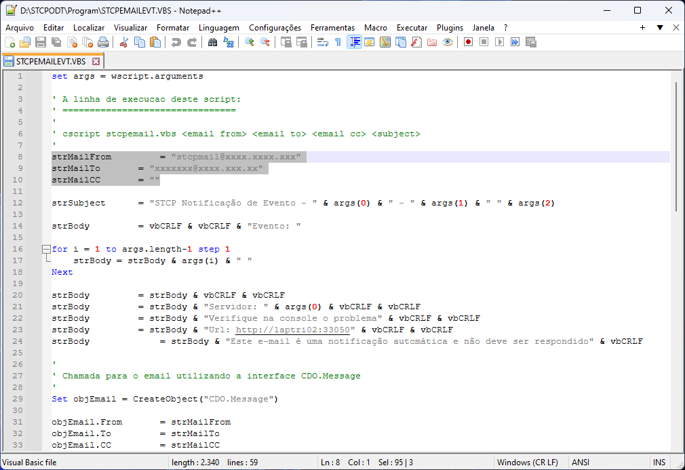
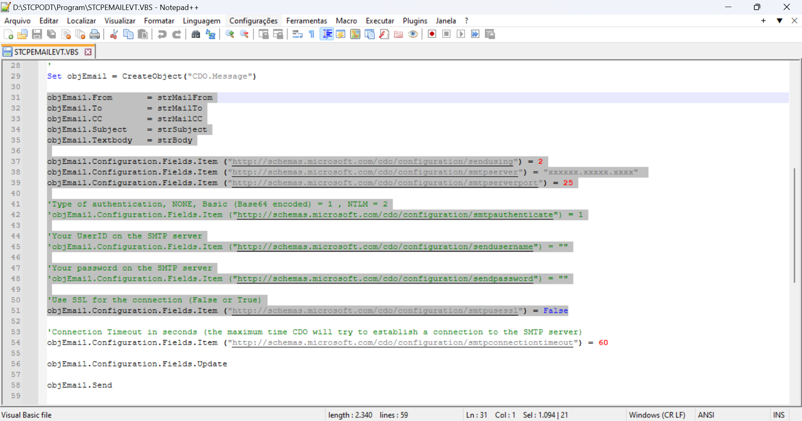
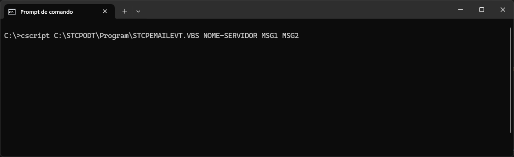
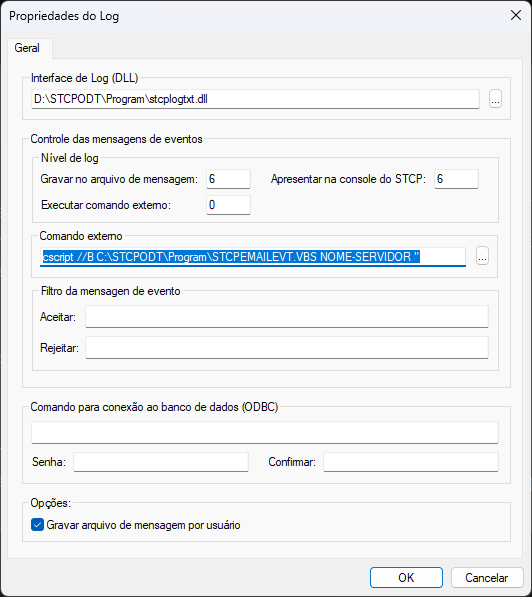
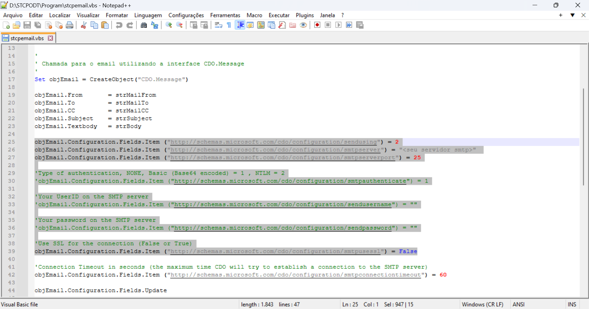
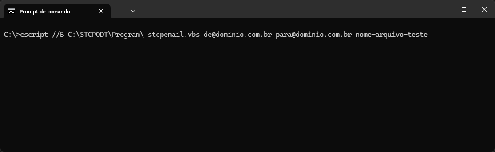
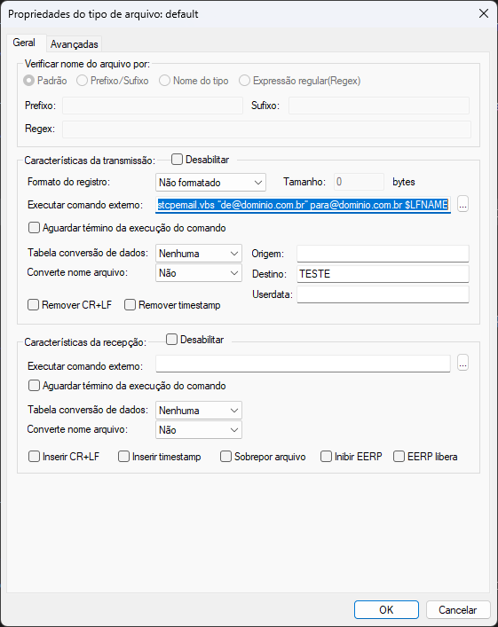

## Notificação e-mail através de Scripts VBS

### Introdução

O STCP OFTP Server nos permite a execução de processos por eventos (início e/ou fim de conexão, transmissão e/ou recepção de arquivos com sucesso, ocorrência de erros, etc.) através de linha de comandos.

Por exemplo, podemos executar um script VBS - previamente configurado - para enviar e-mails para uma determinada área sempre que um arquivo for enviado e/ou recebido com sucesso. Neste mesmo cenário, outro script poderá ser executado sempre que ocorrer alguma falha de conexão ou na transferência dos arquivos. Tais scripts também podem ser utilizados para gerar Traps para um servidor SNMP ou gerar evidências no Event Viewer do sistema operacional.

Nesta seção vamos demonstrar os procedimentos necessários para a configuração e execução dos scripts VBS, responsáveis pelo envio de notificações por e-mail, no STCP. Por se tratar de um script que utiliza uma linguagem universal (Visual Basic Scripting) e distribuída gratuitamente pela Microsoft, podemos customizá-lo para atender as mais diversas necessidades da área de monitoração, assim como filtrar as notificações e erros desejados.

### Configuração de notificações de erro por e-mail

Conforme mencionado nesta seção, é possível configurar o STCP para enviar uma notificação por e-mail sempre que houver algum erro no processo de conexão e/ou transferência de arquivos.

Tal procedimento pode ser realizado através do script _STCPEMAILEVT.VBS_, existente na pasta *Program*, do diretório de instalação (Diretório de Controle) da aplicação (Ex C:\STCPODT\Program).

Edite o arquivo _STCPEMAILEVT.VBS_ e preencha as informações conforme a imagem.



> [!NOTE] Nota
> Como padrão para este documento, utilizaremos o utilitário OpenSSL para realização do processo da geração e configuração do certificado digital. O OpenSSL está localizado na Pasta Program do diretório de instalação do STCP OFTP Server (Ex: C:\STCPODT\Program)


Além das configurações _strMailFrom_,_strMailTo_ também deverão ser configurados os parâmetros referentes ao servidor SMTP.



Salve o arquivo.

Para realizar a validação do funcionamento do script e do servidor SMTP, acesse o "Prompt de Comando" e digite o comando abaixo. Caso nenhuma mensagem de erro seja apresentada, verifique se os e-mails foram recebidos nas contas indicadas.

```
cscript C:\STCPODT\Program\STCPEMAILEVT.VBS NOME-SERVIDOR MSG1 MSG2
```


Após a configuração e testes do script VBS, uma alteração nas Propriedades de Log do STCP será necessária, habilitando a execução de um comando externo sempre ocorrer eventos que contenham algum erro (Nível de log = 1) e informando a linha de comando abaixo no parâmetro **Comando externo**.

```vb.net
cscript //B C:\STCPODT\Program\STCPEMAILEVT.VBS NOME-SERVIDOR "
```

> [!NOTE] Nota:
> Observe que logo após o nome do servidor será necessário inserir uma aspas duplas (abre aspas).




Após a execução destes procedimentos, clique no botão OK para salvar as alterações e [reinicie o serviço do Riversoft STCP OFTP Server](/stcpserver/utilizacao/#serviço-do-stcp-oftp-server) para que as estas sejam ativadas.

Uma vez realizadas as configurações com êxito, um e-mail será encaminhado para os destinatários informados no script sempre que um erro ocorrer no processo de transferência de arquivos.

### Configuração de notificações de envio/recebimento de arquivos

Dentre várias outras possibilidades, além das notificações de erro apresentadas neste procedimento, também é possível gerar notificações para alertar o envio e/ou recebimento (com sucesso) de arquivos.

Tal procedimento pode ser realizado através do script **stcpemail.vbs**, existente na pasta *Program*, do diretório de instalação (Diretório de Controle) da aplicação (Ex: C:\STCPODT\Program).

Edite o arquivo *stcpemail.vbs* e preencha os parâmetros referentes ao servidor SMTP:



Salve o arquivo.

Para realizar a validação do funcionamento do script e do servidor SMTP, acesse o *Prompt de Comando* e digite o comando abaixo. Caso nenhuma mensagem de erro seja apresentada, verifique se os e-mails foram recebidos nas contas indicadas.

```vb
cscript //B C:\STCPODT\Program\ stcpemail.vbs de@dominio.com.br para@dominio.com.br nome-arquivo-teste
```


Acesse o STCP OFTP Server Config (Ex: D:\STCPODT\Program\Riversoft STCP OFTP Server Config) e na guia *Usuários*, selecione o usuário desejado e clique no botão *Propriedades*.

Na janela de propriedades do usuário selecionado, na guia *Tipos de arquivos* selecione o tipo *default* ou o tipo de arquivo desejado e clique no botão *Propriedades*.

Na janela de propriedades do tipo de arquivo desejado, no grupo *Características da transmissão*, preencha o parâmetro *Executar comando externo* com a linha de comando abaixo:

```
cscript //B C:\STCPODT\Program\stcpemail.vbs “de@dominio.com.br” para@dominio.com.br $LFNAME
```

> [!NOTE] Nota: 
> Na linha de comando utilizamos a variável interna do STCP, **$LFNAME**, que nos contém o nome completo do arquivo local. A relação completa das variáveis internas do STCP OFTP Server pode ser obtida no item “Definição das variáveis internas do STCP OFTP Server”, no link: [variáveis internas do STCP](/utils/variables/).



Clique no botão **OK** para salvar as alterações.

Uma vez realizadas as configurações com êxito, um e-mail será encaminhado para o destinatário informado, sempre que um arquivo for transmitido com sucesso. O mesmo procedimento poderá ser utilizado para implantar notificações também na recepção de arquivos.