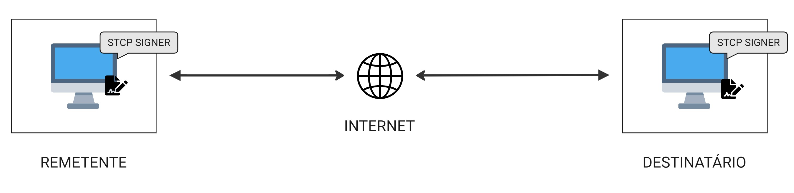
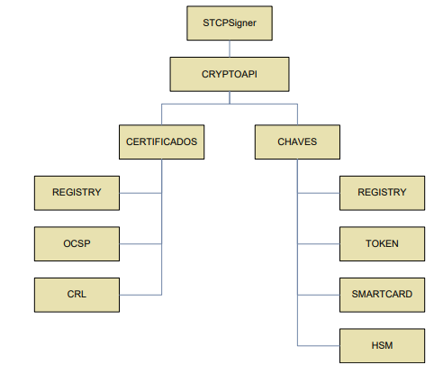
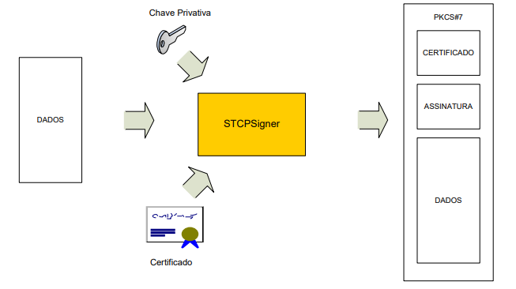
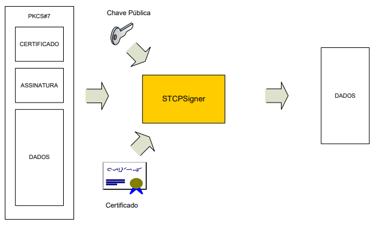
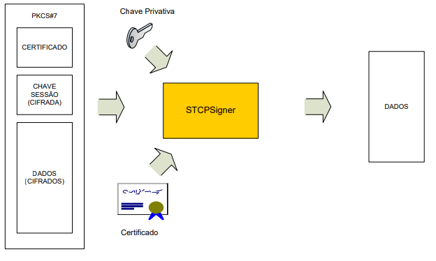

## Introdução
O STCP Signer é um módulo utilizado para garantir a integridade, autenticidade, confidencialidade e inviolabilidade de um arquivo através da tecnologia de assinatura digital e da criptografia.



O STCP Signer implementa a especificação RFC2315 (PKCS#7) e está em conformidade com a norma do Banco Central do Brasil (Carta Circular 3.134) sobre a utilização da assinatura digital em contratos de câmbio.

Um documento eletrônico assinado/criptografado com o STCP Signer poderá ser decriptografado/validado com a utilização de outros produtos que sigam a mesma especificação.

### Arquitetura

O STCP Signer utiliza a interface Microsoft CRYPTOAPI para acesso aos dispositivos criptográficos(Token, Smartcard, etc) e de armazenamento dos certificados digitais.



### Características Gerais

* Assinatura digital com certificado digital X509
* Criptografia com chaves RC2, DES, 3DES, AES (Somente Vista)
* Compatível com **CRYPTOAPI (Microsoft)**
* Compatível com a RFC2315/Carta Circular 3.123 do Banco Central do Brasil
* Compatível com certificados ICP Brasil
* Inclusão do certificado de assinatura no envelope PKCS#7
* Inclusão da cadeia de certificados do assinante no envelope PKCS#7
* Verificação da lista local ou remota de certificados revogados
* Verificação do status do certificado online (OCSP) quando disponível

### Fluxo de Assinatura

No processo de assinatura, o remetente assina digitalmente o arquivo de entrada e o STCP Signer grava o arquivo de saída contendo as informações do certificado utilizado, a assinatura e os dados do arquivo de entrada.

O arquivo de saída é também chamado de PKCS#7.



O STCP Signer deve ser executado com os seguintes parâmetros para realizar o processo de assinatura de um arquivo:

```
stcpsigner sign –i <certificado-remetente> -n <arquivo de entrada> -o <arquivo de saída>
```

### Fluxo da Validação

O STCP Signer utiliza o certificado informado pelo remetente para validar a assinatura, o certificado e os dados contidos no arquivo de entrada para gravar o arquivo de saída somente com os dados.



O STCP Signer deve ser executado com os seguintes parâmetros para realizar o processo de validação da assinatura de um arquivo:

```
stcpsigner verify –i <certificado-remetente> -n <arquivo de entrada> -o <arquivo de saída>
```

### Fluxo de Criptografia

No processo de criptografia, o remetente cifra os dados associando-os à Chave Pública e ao certificado da entidade de destino.


O STCP Signer deve ser executado com os seguintes parâmetros para realizar o processo de criptografia de um arquivo:

```
stcpsigner crypt –i <certificado-destinatário> -n < arquivo de entrada> -o <arquivo de saída>
```
### Fluxo de Decriptografia

Os dados recebidos do remetente são decriptografados com a Chave Privativa correspondente do destinatário.



O STCPSigner deve ser executado com os seguintes parâmetros para realizar o processo de decriptografia de um arquivo:

```
stcpsigner decrypt –i <certificado-destinatário> -n <arquivo de entrada> -o <arquivo de saída>**”
```
