# Configuração inicial

Para o correto funcionamento da ferramenta, deverão ser configurados os seguintes arquivos:

Configure o acesso ao Banco de Dados da ferramenta no arquivo **stcpweb_db.inc**

```
 <disco>:\Inetpub\wwwroot\STCPWEB_ADMIN\conf\stcpweb_db.inc
```
Os parâmetros a serem configurados neste arquivo são:

{}

* **$TipoDBConf** = tipo do gerenciador de banco de dados utilizado. As opções disponíveis são **ACCESS**, **MSSERVER**, **MySql**, **Oracle**, **SQLite** e **Sybase**.
* **$fnameConfDB** = nome da fonte de dados(ODBC) usada para conectar-se à base de dados de configuração.
* **$UsuarioDBConf** = nome do usuário para autenticação na base de dados.
* **$SenhaDBConf** = senha do usuário para autenticação na base de dados.

{}

{}
Configuração da base de dados que gerenciará as informações de operadores, grupos e servidores do STCP OFTP Web Admin:

* **$TipoDBConf** = tipo do gerenciador de banco de dados utilizado. As opções disponíveis são **ACCESS**, **MSSERVER**, **MySql**, **Oracle**, **SQLite** e **Sybase**.
* **$fnameConfDB** = nome da fonte de dados(ODBC) usada para conectar-se à base de dados de configuração.
* **$UsuarioDBConf** = nome do usuário para autenticação na base de dados.
* **$SenhaDBConf** = senha do usuário para autenticação na base de dados.

{}


{}
 Configuração da base de dados que gerenciará as informações de códigos de erros e de eventos do sistema:

* **$TipoDBErros** = tipo do gerenciador de banco de dados utilizado. As opções disponíveis são ACCESS, MSSERVER, MySql, Oracle, SQLite,
Sybase.
* **$fnameErrosDB** = nome da fonte de dados(ODBC) usada para conectar-se à base de dados de erros.
* **$UserDBErros** = nome do usuário para autenticação na base de dados.
* **$SenDBErros** = senha do usuário para autenticação na base de dados.

{}

{}
 Configuração da base de dados que gerenciará as informações de log dos operadores do STCP OFTP Web Admin:

* **$TipoDBLogOper**= tipo do gerenciador de banco de dados utilizado. As opções disponíveis são ACCESS, MSSERVER, MySql, Oracle, SQLite, Sybase.
* **$fnameLogDB** = nome da fonte de dados(ODBC) usada para conectar-se à base de dados de log.
* **$UserDBLogOper** = nome do usuário para autenticação na base de dados.
* **$SenDBLogOper** = senha do usuário para autenticação na base de dados

{}


{}
 <!-- Configuração da sessão da base de dados: -->

* **$SQLAlterSession** = este parâmetro deve ser usado quando a base de dados utilizada for Oracle 8i ou Oracle 10g. Para utilizar este parâmetro, basta retirar o comentário do início da linha.

{}


> [!NOTE] Aviso
> Obs.: As configurações acima podem ser feitas em uma mesma base de dados, ou seja, não é necessário o uso de bases de dados distintas para o funcionamento do STCP OFTP Web Admin.


Verifique nas seção <a href="/stcpwebadmin/iis/">Configuração no IIS</a>, as configurações e procedimentos necessários no IIS para realizar o acesso ao STCP OFTP Web Admin

## Acesso ao STCP OFTP Web Admin

Pelo seu navegador, entre com o endereço do STCP OFTP Web Admin.


Digite **stcpadmin** no campo operador e **teste** em senha.

> [!NOTE] Aviso
> Obs.: para o primeiro login na ferramenta, qualquer nome de operador e senha serão aceitos, já que não existe nenhum operador cadastrado.

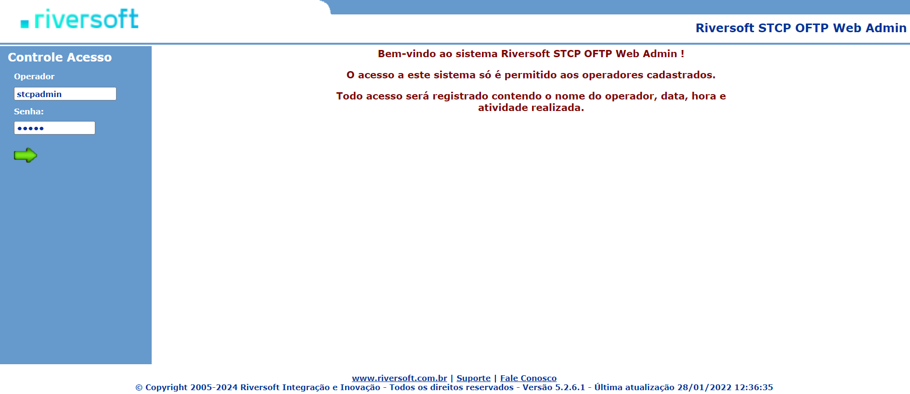

## Cadastro de Administrador do sistema

Acesse **Manutenção → Cadastro → Operadores**.

Clique no botão **+**.

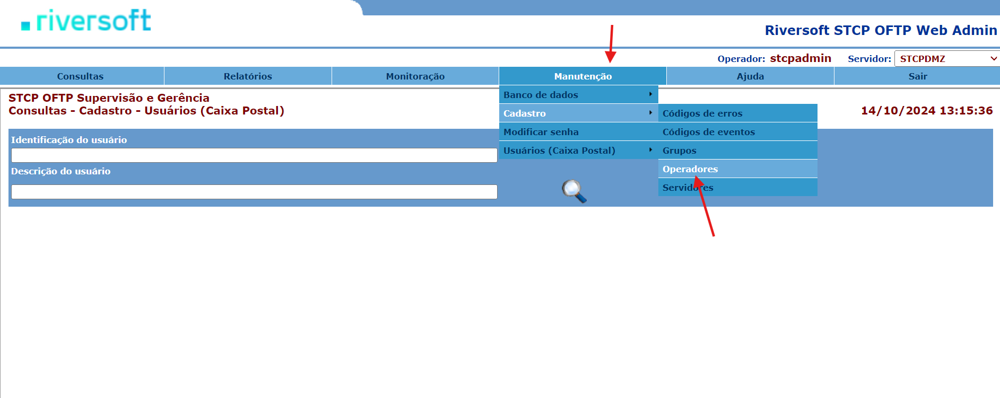

Cadastre o administrador do sistema.

> [!NOTE] Aviso
> Obs.: o administrador do sistema deverá ser obrigatoriamente o **stcpadmin**. Este operador não terá restrições de acesso e poderá gerenciar todos os outros operadores.


Clique no botão para salvar as informações do administrador do sistema.

Clique em **Sair** para acessar o sistema com o novo nome de operador e a nova senha.


## Criação de Grupos

Adicione grupos acessando **Manutenção → Cadastro → Grupos**.

Clique no botão **+**.

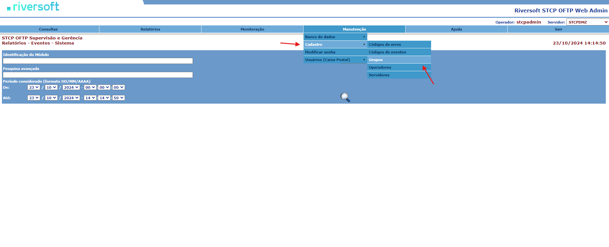

> [!TIP] Dica
> Obs.: para associar todos os servidores a todos os usuários, utilize \ . Para especificar os usuários relacionados ao servidor, basta separar com uma barra invertida \ . Exemplo: **SERV001\USER001**.

Selecione os operadores e as permissões que farão parte do grupo.


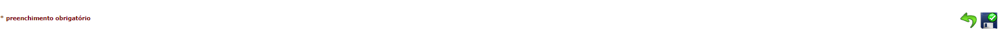

## Cadastro de Operadores

Agora cadastre os operadores que farão parte dos grupos criados.

Acesse **Manutenção → Cadastro → Operadores**.

Clique no botão **+**.


Adicione os operadores, incluindo-os nos grupos adequados.

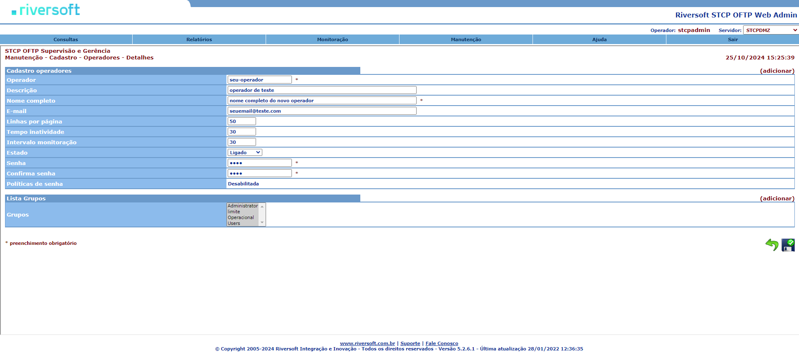


## Cadastro dos Servidores

Adicione grupos acessando **Manutenção → Cadastro → Servidores**.

Clique no botão **+**.


Adicione as informações do servidor.

> [!NOTE]
> Obs.: este servidor refere-se ao servidor de monitoração definido no STCP OFTP Server.

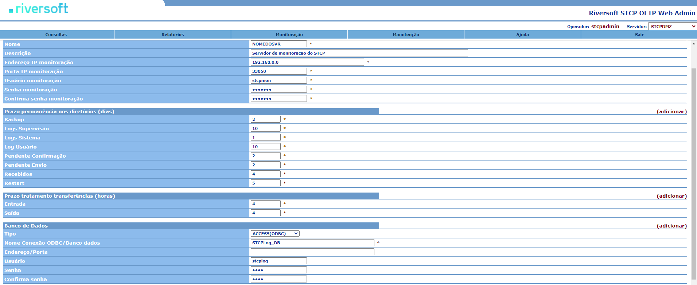


## Funcionalidades

### Consulta aos Agendamentos

Esta funcionalidade permite ao usuário consultar os agendamentos na ferramenta **STCP OFTP Server Enterprise**.

Acesse **Consultas → Cadastro → Agendamentos**.

Informe o nome completo do agendamento no campo **Nome do Agendamento**. Para filtrar os dados da pesquisa, informe também a descrição do agendamento.

Ou clique no botão para visualizar todos os agendamentos.

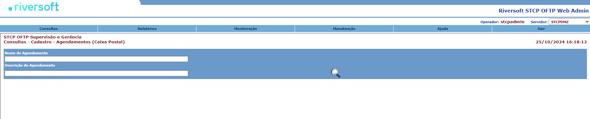

### Consulta aos Códigos de erros

Esta funcionalidade permite ao usuário consultar os **Códigos de erros**.

Acesse **Consultas → Cadastro → Códigos de erros**.

Informe o **Código de erro**. Para filtrar os dados da pesquisa, informe também
a descrição do erro.


### Consulta aos Códigos de eventos

Esta funcionalidade permite ao usuário consultar os **Códigos de eventos**.

Acesse **Consultas → Cadastro → Códigos de eventos**.

Informe o “Código do evento”. Para filtrar os dados da pesquisa, informe também a descrição do evento.

Ou clique na lupa para visualizar todos os códigos de eventos.


### Consulta aos Grupos

Esta funcionalidade permite ao usuário **Consultar os Grupos**.

Acesse **Consultas → Cadastro → Grupos**.

Informe o **Grupo**. Para filtrar os dados da pesquisa, informe também a descrição do grupo.

Ou clique na lupa para visualizar todos os grupos cadastrados.


### Consulta aos Operadores

Esta funcionalidade permite ao usuário consultar os **Operadores**.

Acesse **Consultas → Cadastro → Operadores**.

Informe o **Operador**. Para filtrar os dados da pesquisa, informe também a
descrição do operador.

Ou clique na lupa para visualizar todos os operadores cadastrados.


### Consulta aos Usuários

Esta funcionalidade permite ao usuário consultar os **Usuários cadastrados**.

Acesse **Consultas → Cadastro → Usuários**.

Informe a **Identificação do usuário**. Para filtrar os dados da pesquisa, informe também a **descrição do usuário**.

Ou clique na lupa para visualizar todos os usuários cadastrados.


### Histórico das Transferências

Esta funcionalidade permite ao usuário consultar o **Histórico das Transferências**.

Para consultar o histórico das transferências, acesse **Consultas → Transferências → Histórico**.

Informe a **Identificação do usuário** e o **Nome do arquivo**.

Selecione o **Período considerado** e a **Situação** (Todas, Recebidas/OK, Enviadas/OK, Falha Rx ou Falha Tx).

Ou clique na lupa para visualizar todo o histórico das transferências.


### Transferências Pendentes

Esta funcionalidade permite ao usuário consultar as **Transferências Pendentes**.

Acesse **Consultas → Transferências → Pendentes**.

Informe o **Usuário**. Para filtrar os dados da pesquisa, informe também a descrição do usuário.

Selecione o **Período considerado** e a **Situação** (Pend envio, Pend conf, Pend restart ou Pend tratamento).

Ou clique no botão para visualizar todas as transferências pendentes.

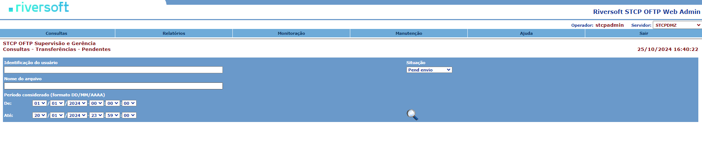

### Relatório de Eventos de Operadores

Esta funcionalidade permite ao usuário consultar o relatório de eventos de operadores organizados por Data/Hora ou pelo operador, em ordem crescente. Os eventos listados no relatório são referentes ao início/fim de sessão, alteração de parâmetros e demais ações realizadas pelos operadores no STCP OFTP Web Admin.

Acesse **Relatórios → Eventos → Operadores**.

Informe a **Identificação do Operador**. Para pesquisa avançada, digite no campo “Pesquisa Avançada” parte do texto do arquivo.

Selecione o **Período considerado**, e DataHora ou Operador em **Ordenado por**.

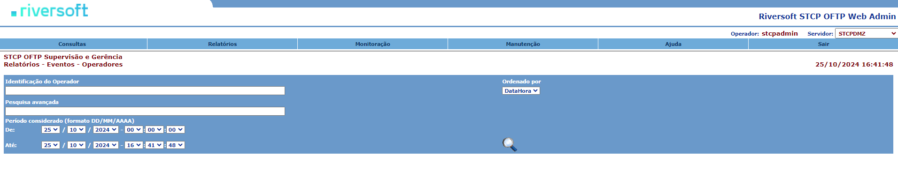

Ou clique na lupa para visualizar todos os eventos.


### Relatório de Eventos do Sistema

Esta funcionalidade permite ao usuário consultar o relatório de eventos do Sistema organizado por Data/Hora ou módulo, em ordem crescente. Os eventos listados no relatório podem ser: início/fim do serviço STCP OFTP, início/fim de conexões entrantes ou saintes, início e término da agenda, início e término de transmissão e recepção de arquivos, erros do sistema/transferência etc.

Acesse **Relatórios → Eventos → Sistema**.

Informe a **Identificação do Módulo**. Para pesquisa avançada, digite no campo “Pesquisa Avançada” o módulo do sistema onde ocorreu o evento. Exemplo: STCP, STCPMON, STCPCONF, etc.

Selecione o **Período considerado**, e DataHora ou Módulo em **Ordenado por**.

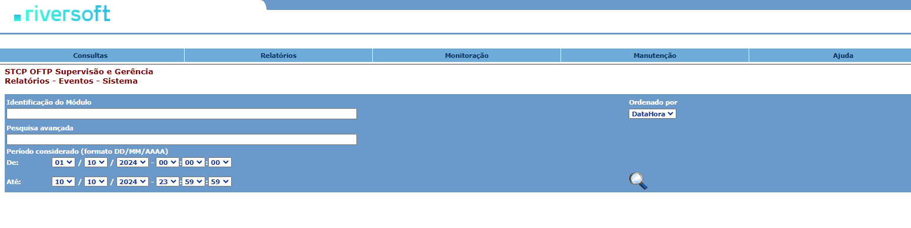

Ou clique na lupa para visualizar todos os eventos conforme a imagem de exemplo abaixo: 

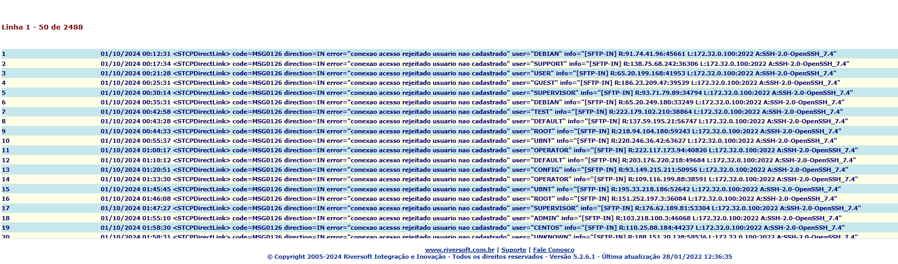

### Relatório de Eventos dos Usuários

Esta funcionalidade permite ao usuário consultar o relatório de eventos dos usuários organizados por Data/Hora ou usuário, em ordem crescente. Os eventos listados no relatório podem ser: início/fim de conexões entrantes ou saintes, início e término de transmissão e recepção de arquivos, erros na transferência do usuário, dentre outros.

Acesse **Relatórios → Eventos → Usuários (Caixa Postal)**.

Informe a **Identificação do Usuário**. Para pesquisa avançada, digite no campo “**Pesquisa Avançada**” parte do texto do arquivo.

Selecione o **Período considerado**, e DataHora ou Usuário em “Ordenado por”.


Ou clique na lupa para visualizar todos os eventos conforme a imagem de exemplo abaixo: 


### Relatório - Auditoria das transferências

Esta funcionalidade permite ao usuário consultar o relatório das transferências organizado por Data/Hora ou usuário, em ordem crescente.

Acesse **Relatórios** → **Transferências** → **Auditoria**.

Informe a **Identificação do Usuário**. Para pesquisa avançada, digite no campo **Pesquisa Avançada** parte do texto do arquivo.

Selecione o **Período considerado**, e DataHora ou Usuário em **Ordenado por**.


Ou clique na lupa para visualizar a auditoria de todas as transferências.


### Relatório - Estatísticas das transferências

Esta funcionalidade permite ao usuário consultar o relatório de estatística das transferências organizado por tipo.

Acesse **Relatórios → Transferências → Estatísticas**.

Informe a **Identificação do usuário**. Para filtrar os dados da pesquisa, informe o **Nome do arquivo**.

Selecione o **Período considerado**, e o **Tipo** de relatório (consolidado, anual, mensal, semanal, dia da semana, Diário ou por hora).


Ou clique na lupa para visualizar a estatística de todas as transferências.


### Relatório - Gráficos das transferências

Esta funcionalidade permite ao usuário visualizar o gráfico das transferências organizado por tipo.

Acesse **Relatórios → Transferências → Gráficos**.

Informe a **Identificação do usuário**. Para filtrar os dados da pesquisa, informe o **Nome do arquivo**.

Selecione o **Período considerado**, e o **Tipo** de relatório (consolidado, anual, mensal, semanal, dia da semana, Diário ou por hora).

Escolha a forma como será apresentado o gráfico.

Ou clique no botão para visualizar o gráfico de todas as transferências.


### Relatório – Roteamentos

Acesse **Relatórios → Roteamentos → Auditoria**.
A pesquisa pode ser feita informando a **Identificação da origem**, por exemplo, que é o nome de usuário.

```
Exemplo: O005RIVERSOFT.
```


Ou informe a **Identificação do destino**.

```
Exemplo: SRSVM-T02.
```


Para visualizar todos os relatórios, clique na lupa.


### Importação de códigos de erros

Para importar os códigos de erros de um arquivo xml para o banco de dados do STCP OFTP Web Admin, acesse **Manutenção → Banco de Dados → Importar Dados**.


Em **Tipo de Dados**, escolha a opção **Códigos de Erros** e clique no botão.

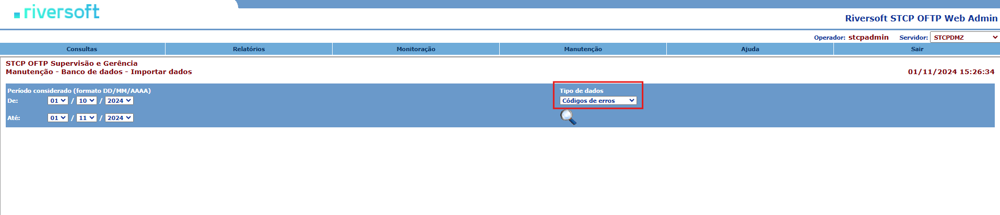

Selecione o arquivo encontrado e clique no botão.


<!-- Quando o processo de importação for concluído, será mostrada a confirmação.

 -->

### Importação de códigos de eventos

Para importar os códigos de eventos de um arquivo xml para o banco de dados da STCP OFTP Web Admin, acesse **Manutenção → Banco de Dados → Importar Dados**.


Em Tipo de Dados, escolha a opção Códigos de Eventos e clique no botão.

Selecione o arquivo encontrado e clique no botão.


Quando o processo de importação for concluído, será mostrada a confirmação.

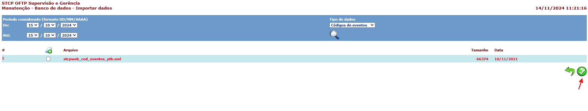

### Exportação de códigos de erros

Para exportar os códigos de erros da base de dados do STCP OFTP Web Admin para um arquivo xml, acesse **Manutenção → Banco de Dados → Exportar Dados**.

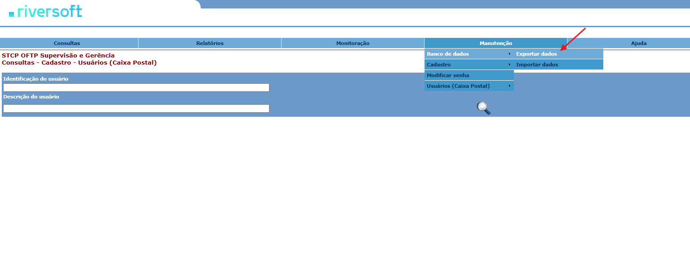

Em **Tipo de Dados**, escolha a opção **Códigos de Erros** e clique no botão.


Para realizar a exportação dos dados, clique no botão.

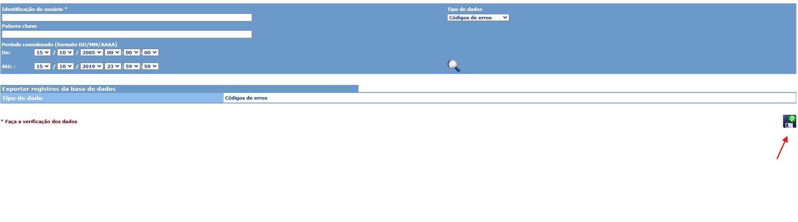

Quando o processo de exportação for concluído, será mostrada a confirmação.


### Exportação de códigos de eventos

Para exportar os códigos de eventos da base de dados do STCP OFTP Web Admin para um arquivo xml, acesse **Manutenção → Banco de Dados → Exportar Dados**.


Em Tipo de Dados, escolha a opção Códigos de Eventos e clique no botão.

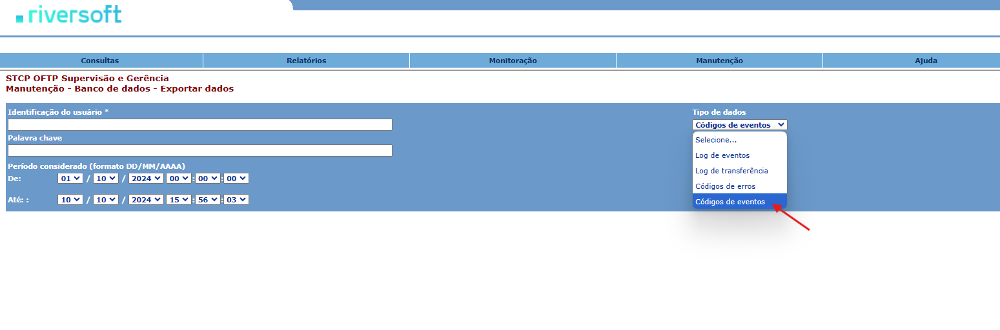

Para realizar a exportação dos dados, clique no botão.

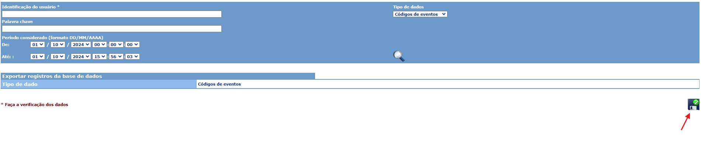

Quando o processo de exportação for concluído, será mostrada a confirmação.


### Cadastro de códigos de erros

Para cadastrar um código de erro, acesse **Manutenção → Cadastro → Códigos de erros**.

Clique no botão **+**.


Preencha os campos: **código, descrição** e **procedimento**.

Selecione a classificação do erro no campo **Classe**.


Clique no botão para salvar as informações do código de erro.

### Cadastro de códigos de eventos

Para cadastrar um código de evento, acesse **Manutenção → Cadastro → Códigos de eventos**.

Clique no botão.


Preencha os campos: **código, descrição e procedimento**.


Clique no botão para salvar as informações do código de evento.

### Modificar senha de operador

Para modificar a senha do operador do STCP OFTP Web Admin, acesse **Manutenção → Modificar senha**.

> [!NOTE]
> Obs.: este procedimento modifica a senha do operador que está logado na ferramenta.


Preencha os campos: **senha atual, nova senha** e **confirma**.


Clique no botão para salvar a nova senha.

### Limpeza de diretório de Usuários (Caixa Postal)

Para realizar a limpeza de diretório de uma caixa postal do STCP OFTP Server, acesse **Manutenção → Usuários (Caixa Postal) → Limpar diretório**.

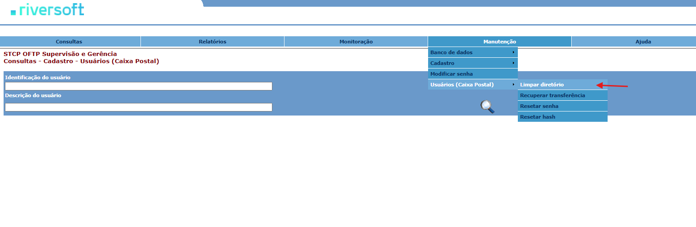

Preencha os campos:

|          Campo           |                                                                              Descrição                                                                              |
| :----------------------: | :-----------------------------------------------------------------------------------------------------------------------------------------------------------------: |
| Identificação do usuário |                                                                        Nome da caixa postal.                                                                        |
|     Nome do arquivo      |                                  Nome do arquivo que deseja buscar. Caso queira ver todos os arquivos, deixe este campo em branco.                                  |
|   Período considerado    |                                              Refere-se à data de criação do arquivo dentro do diretório especificado.                                               |
|        Diretório         | Selecione o diretório onde deseja fazer a limpeza. As opções disponíveis são: _backup, pendente de envio, pendente de confirmação, recebidos, pendente de restart_. |
----------

<br>

Clique no botão para realizar a pesquisa no diretório.


Selecione os arquivos que deseja remover e salve.

<!--  -->

Quando o processo de limpeza for concluído, será mostrada a confirmação.

<!--  -->

### Recuperar transferência de Usuários (Caixa Postal)

Para recuperar uma transferência de uma caixa postal do STCP OFTP Server, acesse **Manutenção → Usuários (Caixa Postal) → Recuperar transferência**.

> [!NOTE] Aviso
> Obs.: este procedimento recupera uma transferência do diretório **Backup** e coloca no diretório **Saída** da caixa postal.

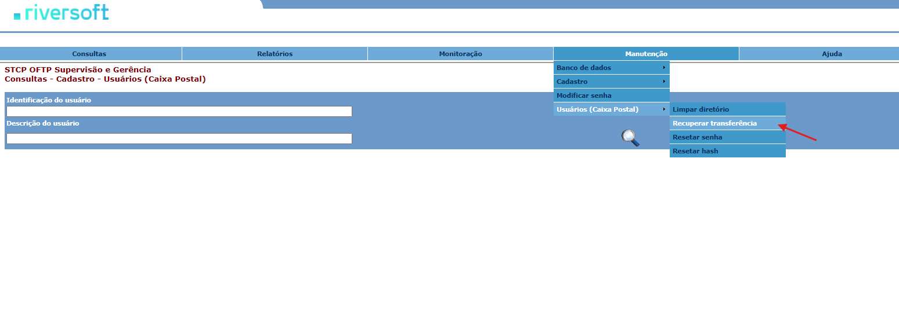

Preencha os campos:

|          Campo           |                               Descrição                               |
| :----------------------: | :-------------------------------------------------------------------: |
| Identificação do usuário |                         Nome da caixa postal.                         |
|     Nome do arquivo      |            Nome completo do arquivo que deseja recuperar.             |
|   Período considerado    | Refere-se à data de criação do arquivo dentro do diretório de backup. |
----------

<br>

Clique no botão para buscar o arquivo.


Selecione o arquivo.

<!--  -->

Quando o processo de recuperação for concluído, será mostrada a confirmação.

<!--  -->

### Resetar senha de Usuários (Caixa Postal)

Para resetar a senha de uma caixa postal do STCP OFTP Server, acesse **Manutenção → Usuários (Caixa Postal) → Resetar senha**.


Preencha os campos: **usuário (caixa postal), nova senha** e **confirma**.


Clique no botão para salvar a nova senha da caixa postal.

### Executar agendamento do STCP OFTP Server

Para executar um agendamento do STCP OFTP Server, acesse **Monitoração → Agendamentos → Executar.**


Preencha os campos:

|    Campo    |                                                 Descrição                                                 |
| :---------: | :-------------------------------------------------------------------------------------------------------: |
| Agendamento | Nome do agendamento que deseja buscar. Caso queira ver todos os agendamentos, deixe este campo em branco. |
|  Descrição  |           Descrição do agendamento. Use este campo para filtrar os agendamentos pela descrição.           |
----------
<br>

Clique na lupa para buscar o agendamento.


Clique sobre o nome do agendamento para executá-lo.

<!--  -->

Será aberta uma nova janela informando o resultado da execução do agendamento.

> [!NOTE] Aviso
> Obs.: se o agendamento estiver desabilitado, não será possível executá-lo.

<!--  -->

### Alterar estado de agendamento do STCP OFTP Server

Para alterar o estado de um agendamento do STCP OFTP Server, acesse **Monitoração → Agendamentos → Alterar estado**.

> [!NOTE] Aviso
> Obs.: este procedimento permite que um agendamento seja bloqueado/desbloqueado.


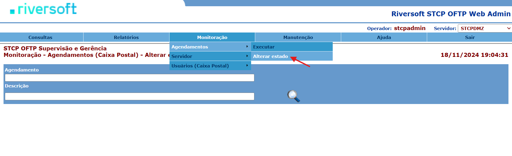

Preencha os campos:

|    Campo    |                                                 Descrição                                                 |
| :---------: | :-------------------------------------------------------------------------------------------------------: |
| Agendamento | Nome do agendamento que deseja buscar. Caso queira ver todos os agendamentos, deixe este campo em branco. |
|  Descrição  |           Descrição do agendamento. Use este campo para filtrar os agendamentos pela descrição.           |
----------
<br>

Clique na lupa para buscar o agendamento.


Clique sobre o nome do agendamento para alterar seu estado.

<!--  -->

O estado do agendamento é mostrado no lado direito da janela.

<!--  -->

### Monitorar eventos do servidor

Para visualizar os eventos do servidor de monitoração do STCP OFTP Server, acesse **Monitoração → Servidor → Eventos**.

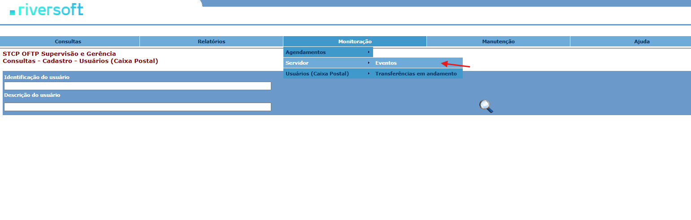

> [!NOTE]
> A monitoração do servidor permite visualizar, em tempo real, todos os eventos[1] da sessão atual do serviço do STCP OFTP. Esta página é atualizada de tempos em tempos.


> ¹ Início/fim do serviço STCP OFTP, Início/Fim de conexões entrantes/saintes, Início e Término da agenda, Início e Término de transmissão e recepção de arquivos, Erros do sistema/transferência, dentre outros.

### Monitorar transferências

Para monitorar as transferências em andamento, acesse **Monitoração → Servidor → Transferências em andamento.**


> [!NOTE] Aviso
> As transferências são monitoradas em tempo real e a página é atualizada de tempos em tempos.

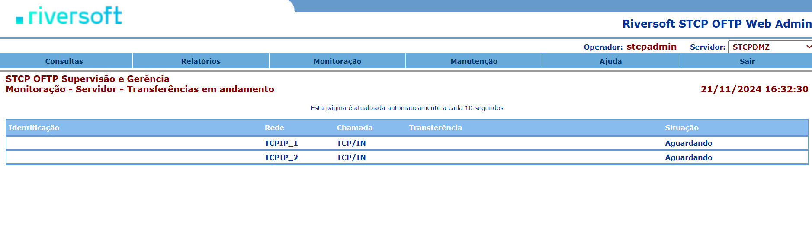

### Iniciar conexão com usuários (Caixa Postal)

Para iniciar uma conexão com uma caixa postal do STCP OFTP Server, acesse **Monitoração → Usuários (Caixa Postal) → Iniciar Conexão**.

> [!NOTE] Aviso
> Obs.: esta funcionalidade só está disponível para caixas postais que estejam com a conexão automática habilitada.

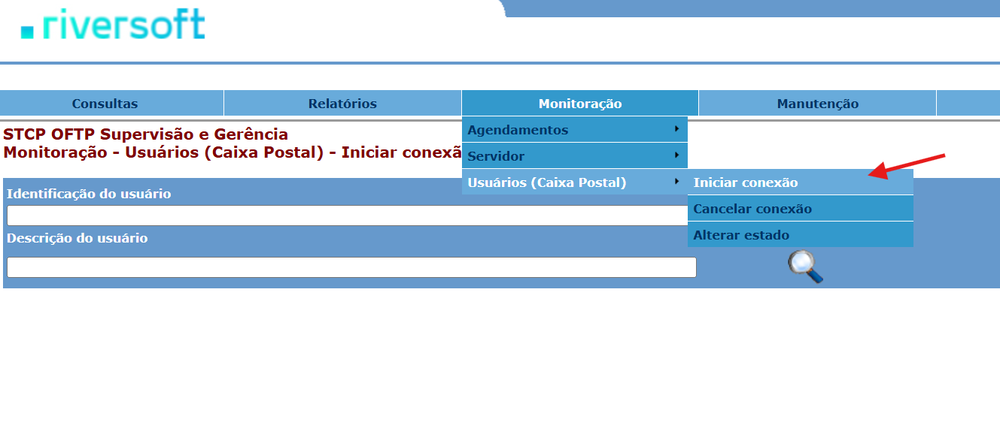

Preencha os campos:

|          Campo           |                                         Descrição                                          |
| :----------------------: | :----------------------------------------------------------------------------------------: |
| Identificação do usuário | Nome da caixa postal. Caso queira ver todas as caixas postais, deixe este campo em branco. |
|   Descrição do usuário   | Descrição da caixa postal. Use este campos para filtrar as caixas postais pela descrição.  |
----------
<br>

Clique na lupa para realizar a busca.


Clique sobre o  nome da caixa postal para iniciar a conexão.

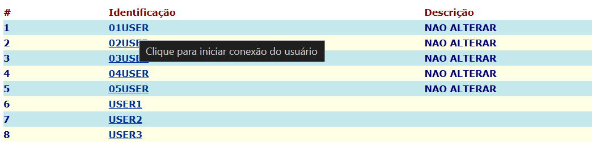

Será aberta uma nova janela mostrando o resultado da conexão do usuário.

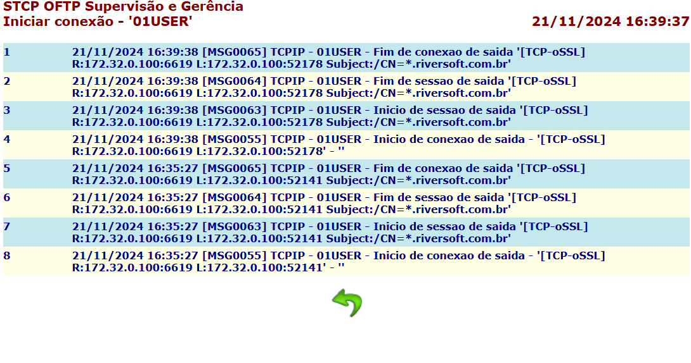

### Cancelar conexão com usuários (Caixa Postal)

Para cancelar uma conexão com uma caixa postal do STCP OFTP Server, acesse **Monitoração → Usuários (Caixa Postal) → Cancelar Conexão**.

> [!NOTE] Aviso
> Obs.: esta funcionalidade só está disponível para caixas postais que estejam com a conexão automática habilitada.


Preencha os campos:

|          Campo           |                                         Descrição                                          |
| :----------------------: | :----------------------------------------------------------------------------------------: |
| Identificação do usuário | Nome da caixa postal. Caso queira ver todas as caixas postais, deixe este campo em branco. |
|   Descrição do usuário   | Descrição da caixa postal. Use este campos para filtrar as caixas postais pela descrição.  |
----------
<br>

Clique na lupa para realizar a busca.

Clique sobre o  nome da caixa postal para cancelar a conexão.


Será aberta uma nova janela mostrando o resultado do cancelamento da conexão do usuário.

<!--  -->

### Alterar estado de usuários (Caixa Postal)

Para alterar o estado de uma caixa postal do STCP OFTP Server, acesse **Monitoração → Usuários (Caixa Postal) → Alterar estado**.

> [!NOTE] Aviso
> Obs.: este procedimento permite que uma caixa postal seja bloqueada/desbloqueada.


Preencha os campos:

|          Campo           |                                                  Descrição                                                   |
| :----------------------: | :----------------------------------------------------------------------------------------------------------: |
| Identificação do usuário | Nome da caixa postal que deseja buscar. Caso queira ver todas as caixas postais, deixe este campo em branco. |
|   Descrição do usuário   |          Descrição da caixa postal. Use este campos para filtrar as caixas postais pela descrição.           |
----------
<br>

Clique na lupa realizar a busca.


Clique sobre o nome da caixa postal para alterar seu estado.


O estado da caixa postal é mostrado no lado direito da janela.


## Glossário

<div class="glossary-section">
  <div class="letter-group">
    <h3>I</h3>
    <p><strong>IUSR</strong> - Conta Interna para acesso anônimo ao Internet Information Service.</p>
  </div>

  <div class="letter-group">
    <h3>S</h3>
    <p><strong>System DSN</strong> - Pode ser usado por alguém que tenha acesso à máquina.</p>
  </div>
</div>

<style>
  .glossary-section {
    font-family: 'Poppins', sans-serif;
    background-color: #f9f9f9;
    padding: 20px;
    border-radius: 8px;
    box-shadow: 0 4px 6px rgba(0, 0, 0, 0.1);
    max-width: 800px;
    margin: 20px auto;
  }

  .letter-group {
    margin-bottom: 20px;
  }

  .letter-group h3 {
    font-size: 1.8em;
    color: #333;
    border-bottom: 2px solid #007acc;
    display: inline-block;
    margin-bottom: 10px;
  }

  .letter-group p {
    font-size: 1.1em;
    color: #555;
    margin-left: 20px;
    text-indent: -20px;
    padding-left: 20px;
    line-height: 1.6;
  }

  strong {
    color: #333;
  }
</style>

