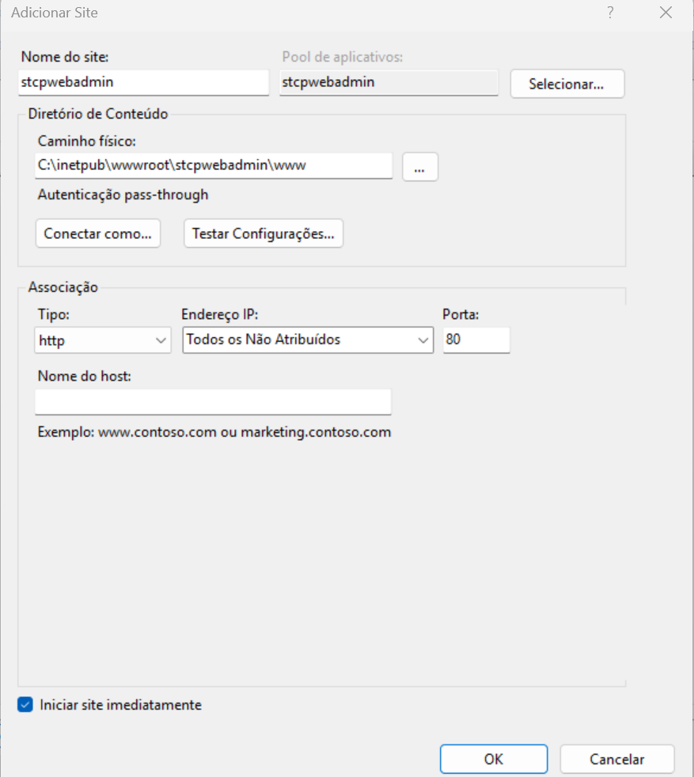

# Introdução

Esta seção tem por objetivo descrever os passos necessários para configuração do STCP OFTP Web Admin no IIS.

  
Para maiores detalhes sobre as versões do IIS e da sua respectiva data de suporte acesse: <a href="https://learn.microsoft.com/pt-br/lifecycle/products/internet-information-services-iis" target="_blank">IIS (Serviços de Informações da Internet)</a>  &nbsp;


Para realização destes procedimentos os seguintes pré-requisitos são necessários:

* Instalação do IIS no servidor;
* Instalação do STCP OFTP Web Admin;
* Criação do banco de dados STCP OFTP Web Admin;
* Configuração do driver ODBC para acesso ao banco de dados do STCP OFTP Web Admin;
* Instalação e configuração do processador de scripts PHP.

Maiores detalhes relacionados à instalação do STCP OFTP Web Admin podem ser obtidos na seção de [instalação](/stcpwebadmin/install/)

## Configurando o IIS para manipular requisições PHP

Abra o Gerenciador de Serviços de Informações da Internet (IIS), selecione o nome do servidor e de um duplo clique em **Mapeamentos de Manipulador**.

No painel **Ações**, clique em **Adicionar mapeamento de Script**.

Na janela **Adicionar Mapeamento de Script** preencha os parâmetros solicitados conforme a imagem abaixo e pressione o botão **OK**. Note que no parâmetro **Executável** deverá ser informado o diretório do arquivo **php-cgi.exe** no ambiente em questão.

Neste procedimento a instalação do PHP foi realizada no diretório **C:\PHP5**.

A mensagem abaixo poderá ser exibida solicitando permissão para adicionar a extensão ISAPI. Clique no botão **Sim** para continuar.

## Criação e configuração do site no IIS

Ainda na janela do Gerenciador de Serviços de Informações da Internet (IIS), selecione **Sites** e no painel **Ações** clique em **Adicionar Site**.

Na janela **Adicionar Site** preencha os parâmetros solicitados conforme imagem abaixo e pressione o botão “OK” para concluir a criação do site. Note que no parâmetro **Caminho físico** deverá ser informado a pasta **www** do diretório de instalação do STCP OFTP Web Admin no ambiente em questão.

Neste procedimento a instalação do STCP OFTP Web Admin foi realizada no diretório **C:\inetpub\wwwroot\stcpwebadmin**.


 Verique com o administrador de rede quais as configurações corretas para a etapa anterior.


O novo site será exibido no painel **Conexões**, da janela do Gerenciador de Serviços de Informações da Internet (IIS).

Selecione este novo site (Ex. stcpwebadmin) e na área **IIS**, dê um duplo clique no ícone **Documento Padrão**.

No painel **Ações** clique em **Adicionar**.

Na janela **Adicionar Documento Padrão** preencha o parâmetro solicitado conforme imagem abaixo e pressione o botão **OK** para concluir a configuração do documento padrão.

Selecione novamente o novo site (Ex. stcpwebadmin) e no painel **Ações**, clique em **Procurar *:XX (http)**. Onde **XX** refere-se à porta configurada.

Se todos os pré-requisitos foram atendidos e os passos deste procedimento seguidos corretamente, a janela do STCP OFTP Web Admin deverá ser exibida.

