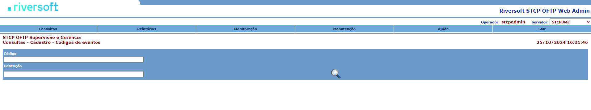
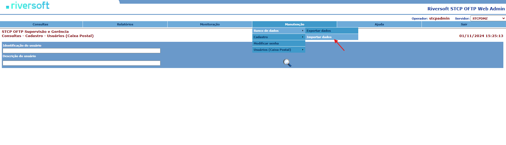
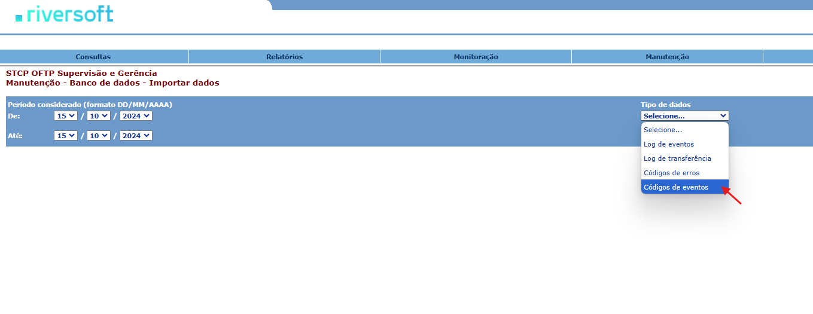
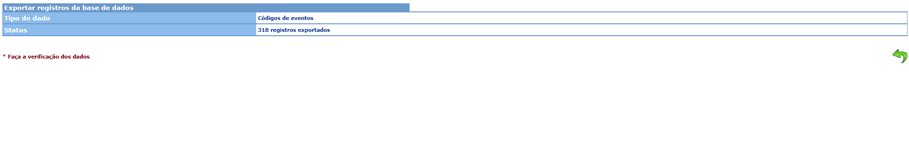
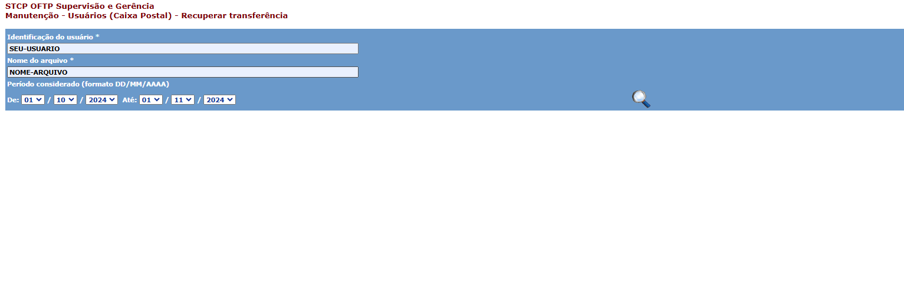

# Configuração inicial

Para o correto funcionamento da ferramenta, deverão ser configurados os seguintes arquivos:

Configure o acesso ao Banco de Dados da ferramenta no arquivo **stcpweb_db.inc**

```
 <disco>:\Inetpub\wwwroot\STCPWEB_ADMIN\conf\stcpweb_db.inc
```
Os parâmetros a serem configurados neste arquivo são:

{}

* **$TipoDBConf** = tipo do gerenciador de banco de dados utilizado. As opções disponíveis são **ACCESS**, **MSSERVER**, **MySql**, **Oracle**, **SQLite** e **Sybase**.
* **$fnameConfDB** = nome da fonte de dados(ODBC) usada para conectar-se à base de dados de configuração.
* **$UsuarioDBConf** = nome do usuário para autenticação na base de dados.
* **$SenhaDBConf** = senha do usuário para autenticação na base de dados.

{}

{}
Configuração da base de dados que gerenciará as informações de operadores, grupos e servidores do STCP OFTP Web Admin:

* **$TipoDBConf** = tipo do gerenciador de banco de dados utilizado. As opções disponíveis são **ACCESS**, **MSSERVER**, **MySql**, **Oracle**, **SQLite** e **Sybase**.
* **$fnameConfDB** = nome da fonte de dados(ODBC) usada para conectar-se à base de dados de configuração.
* **$UsuarioDBConf** = nome do usuário para autenticação na base de dados.
* **$SenhaDBConf** = senha do usuário para autenticação na base de dados.

{}


{}
 Configuração da base de dados que gerenciará as informações de códigos de erros e de eventos do sistema:

* **$TipoDBErros** = tipo do gerenciador de banco de dados utilizado. As opções disponíveis são ACCESS, MSSERVER, MySql, Oracle, SQLite,
Sybase.
* **$fnameErrosDB** = nome da fonte de dados(ODBC) usada para conectar-se à base de dados de erros.
* **$UserDBErros** = nome do usuário para autenticação na base de dados.
* **$SenDBErros** = senha do usuário para autenticação na base de dados.

{}

{}
 Configuração da base de dados que gerenciará as informações de log dos operadores do STCP OFTP Web Admin:

* **$TipoDBLogOper**= tipo do gerenciador de banco de dados utilizado. As opções disponíveis são ACCESS, MSSERVER, MySql, Oracle, SQLite, Sybase.
* **$fnameLogDB** = nome da fonte de dados(ODBC) usada para conectar-se à base de dados de log.
* **$UserDBLogOper** = nome do usuário para autenticação na base de dados.
* **$SenDBLogOper** = senha do usuário para autenticação na base de dados

{}


{}
 <!-- Configuração da sessão da base de dados: -->

* **$SQLAlterSession** = este parâmetro deve ser usado quando a base de dados utilizada for Oracle 8i ou Oracle 10g. Para utilizar este parâmetro, basta retirar o comentário do início da linha.

{}



Obs.: As configurações acima podem ser feitas em uma mesma base de dados, ou seja, não é necessário o uso de bases de dados distintas para o funcionamento do STCP OFTP Web Admin.


Verifique nas seção <a href="/stcpwebadmin/iis/">Configuração no IIS</a>, as configurações e procedimentos necessários no IIS para realizar o acesso ao STCP OFTP Web Admin

## Acesso ao STCP OFTP Web Admin

<span style="display:inline-block; width: 25px; height: 25px; border-radius: 50%; background-color: #0095C7; color: white; text-align: center; line-height: 25px; font-size: 14px; font-family: Arial;">1</span> &nbsp; Pelo seu navegador, entre com o endereço do STCP OFTP Web Admin.


<span style="display:inline-block; width: 25px; height: 25px; border-radius: 50%; background-color: #0095C7; color: white; text-align: center; line-height: 25px; font-size: 14px; font-family: Arial;">2</span> &nbsp;Digite **stcpadmin** no campo operador e **teste** em senha.


Obs.: para o primeiro login na ferramenta, qualquer nome de operador e senha serão aceitos, já que não existe nenhum operador cadastrado.



## Cadastro de Administrador do sistema

<span style="display:inline-block; width: 25px; height: 25px; border-radius: 50%; background-color: #0095C7; color: white; text-align: center; line-height: 25px; font-size: 14px; font-family: Arial;">1</span> &nbsp;Acesse **Manutenção → Cadastro → Operadores**.

<span style="display:inline-block; width: 25px; height: 25px; border-radius: 50%; background-color: #0095C7; color: white; text-align: center; line-height: 25px; font-size: 14px; font-family: Arial;">2</span> &nbsp;Clique no botão **+**.


<span style="display:inline-block; width: 25px; height: 25px; border-radius: 50%; background-color: #0095C7; color: white; text-align: center; line-height: 25px; font-size: 14px; font-family: Arial;">3</span> &nbsp;Cadastre o administrador do sistema.


Obs.: o administrador do sistema deverá ser obrigatoriamente o **stcpadmin**. Este operador não terá restrições de acesso e poderá gerenciar todos os outros operadores.



<span style="display:inline-block; width: 25px; height: 25px; border-radius: 50%; background-color: #0095C7; color: white; text-align: center; line-height: 25px; font-size: 14px; font-family: Arial;">4</span> &nbsp;Clique no botão para salvar as informações do administrador do sistema.

<span style="display:inline-block; width: 25px; height: 25px; border-radius: 50%; background-color: #0095C7; color: white; text-align: center; line-height: 25px; font-size: 14px; font-family: Arial;">5</span> &nbsp;Clique em **Sair** para acessar o sistema com o novo nome de operador e a nova senha.


## Criação de Grupos

<span style="display:inline-block; width: 25px; height: 25px; border-radius: 50%; background-color: #0095C7; color: white; text-align: center; line-height: 25px; font-size: 14px; font-family: Arial;">1</span> &nbsp;Adicione grupos acessando **Manutenção → Cadastro → Grupos**.

<span style="display:inline-block; width: 25px; height: 25px; border-radius: 50%; background-color: #0095C7; color: white; text-align: center; line-height: 25px; font-size: 14px; font-family: Arial;">2</span> &nbsp;Clique no botão **+**.


<span style="display:inline-block; width: 25px; height: 25px; border-radius: 50%; background-color: #0095C7; color: white; text-align: center; line-height: 25px; font-size: 14px; font-family: Arial;">3</span> &nbsp;Preencha os campos: nome, descrição e servidor/usuário.


Obs.: para associar todos os servidores a todos os usuários, utilize \ . Para especificar os usuários relacionados ao servidor, basta separar com uma barra invertida \ . Exemplo: **SERV001\USER001**.


<span style="display:inline-block; width: 25px; height: 25px; border-radius: 50%; background-color: #0095C7; color: white; text-align: center; line-height: 25px; font-size: 14px; font-family: Arial;">4</span> &nbsp;Selecione os operadores e as permissões que farão parte do grupo.


<span style="display:inline-block; width: 25px; height: 25px; border-radius: 50%; background-color: #0095C7; color: white; text-align: center; line-height: 25px; font-size: 14px; font-family: Arial;">5</span> &nbsp;Clique no botão para salvar as informações do grupo.

## Cadastro de Operadores

<span style="display:inline-block; width: 25px; height: 25px; border-radius: 50%; background-color: #0095C7; color: white; text-align: center; line-height: 25px; font-size: 14px; font-family: Arial;">1</span> &nbsp;Agora cadastre os operadores que farão parte dos grupos criados.

<span style="display:inline-block; width: 25px; height: 25px; border-radius: 50%; background-color: #0095C7; color: white; text-align: center; line-height: 25px; font-size: 14px; font-family: Arial;">2</span> &nbsp;Acesse **Manutenção → Cadastro → Operadores**.

<span style="display:inline-block; width: 25px; height: 25px; border-radius: 50%; background-color: #0095C7; color: white; text-align: center; line-height: 25px; font-size: 14px; font-family: Arial;">3</span> &nbsp;Clique no botão **+**.


<span style="display:inline-block; width: 25px; height: 25px; border-radius: 50%; background-color: #0095C7; color: white; text-align: center; line-height: 25px; font-size: 14px; font-family: Arial;">4</span> &nbsp;Adicione os operadores, incluindo-os nos grupos adequados.


<span style="display:inline-block; width: 25px; height: 25px; border-radius: 50%; background-color: #0095C7; color: white; text-align: center; line-height: 25px; font-size: 14px; font-family: Arial;">5</span> &nbsp;Clique no botão para salvar as informações do operador.

## Cadastro dos Servidores

<span style="display:inline-block; width: 25px; height: 25px; border-radius: 50%; background-color: #0095C7; color: white; text-align: center; line-height: 25px; font-size: 14px; font-family: Arial;">1</span> &nbsp;Adicione grupos acessando **Manutenção → Cadastro → Servidores**.

<span style="display:inline-block; width: 25px; height: 25px; border-radius: 50%; background-color: #0095C7; color: white; text-align: center; line-height: 25px; font-size: 14px; font-family: Arial;">2</span> &nbsp;Clique no botão **+**.


<span style="display:inline-block; width: 25px; height: 25px; border-radius: 50%; background-color: #0095C7; color: white; text-align: center; line-height: 25px; font-size: 14px; font-family: Arial;">3</span> &nbsp;Adicione as informações do servidor.


Obs.: este servidor refere-se ao servidor de monitoração definido no STCP OFTP Server.



<span style="display:inline-block; width: 25px; height: 25px; border-radius: 50%; background-color: #0095C7; color: white; text-align: center; line-height: 25px; font-size: 14px; font-family: Arial;">4</span> &nbsp;Clique no botão para salvar as informações do servidor.

## Funcionalidades

### Consulta aos Agendamentos

<span style="display:inline-block; width: 25px; height: 25px; border-radius: 50%; background-color: #0095C7; color: white; text-align: center; line-height: 25px; font-size: 14px; font-family: Arial;">1</span> &nbsp;Esta funcionalidade permite ao usuário consultar os agendamentos na ferramenta **STCP OFTP Server Enterprise**.

<span style="display:inline-block; width: 25px; height: 25px; border-radius: 50%; background-color: #0095C7; color: white; text-align: center; line-height: 25px; font-size: 14px; font-family: Arial;">2</span> &nbsp;Acesse **Consultas → Cadastro → Agendamentos**.

<span style="display:inline-block; width: 25px; height: 25px; border-radius: 50%; background-color: #0095C7; color: white; text-align: center; line-height: 25px; font-size: 14px; font-family: Arial;">3</span> &nbsp;Informe o nome completo do agendamento no campo **Nome do Agendamento**. Para filtrar os dados da pesquisa, informe também a descrição do agendamento.

<span style="display:inline-block; width: 25px; height: 25px; border-radius: 50%; background-color: #0095C7; color: white; text-align: center; line-height: 25px; font-size: 14px; font-family: Arial;">4</span> &nbsp;Ou clique no botão para visualizar todos os agendamentos.


### Consulta aos Códigos de erros

Esta funcionalidade permite ao usuário consultar os **Códigos de erros**.

<span style="display:inline-block; width: 25px; height: 25px; border-radius: 50%; background-color: #0095C7; color: white; text-align: center; line-height: 25px; font-size: 14px; font-family: Arial;">1</span> &nbsp;Acesse **Consultas → Cadastro → Códigos de erros**.

<span style="display:inline-block; width: 25px; height: 25px; border-radius: 50%; background-color: #0095C7; color: white; text-align: center; line-height: 25px; font-size: 14px; font-family: Arial;">2</span> &nbsp;Informe o **Código de erro**. Para filtrar os dados da pesquisa, informe também
a descrição do erro.

<span style="display:inline-block; width: 25px; height: 25px; border-radius: 50%; background-color: #0095C7; color: white; text-align: center; line-height: 25px; font-size: 14px; font-family: Arial;">3</span> &nbsp;Ou clique no botão para visualizar todos os códigos de erros.


### Consulta aos Códigos de eventos

Esta funcionalidade permite ao usuário consultar os **Códigos de eventos**.

<span style="display:inline-block; width: 25px; height: 25px; border-radius: 50%; background-color: #0095C7; color: white; text-align: center; line-height: 25px; font-size: 14px; font-family: Arial;">1</span> &nbsp;Acesse **Consultas → Cadastro → Códigos de eventos**.

<span style="display:inline-block; width: 25px; height: 25px; border-radius: 50%; background-color: #0095C7; color: white; text-align: center; line-height: 25px; font-size: 14px; font-family: Arial;">2</span> &nbsp;Informe o “Código do evento”. Para filtrar os dados da pesquisa, informe também a descrição do evento.

<span style="display:inline-block; width: 25px; height: 25px; border-radius: 50%; background-color: #0095C7; color: white; text-align: center; line-height: 25px; font-size: 14px; font-family: Arial;">3</span> &nbsp;Ou clique no botão para visualizar todos os códigos de eventos.



### Consulta aos Grupos

Esta funcionalidade permite ao usuário **Consultar os Grupos**.

<span style="display:inline-block; width: 25px; height: 25px; border-radius: 50%; background-color: #0095C7; color: white; text-align: center; line-height: 25px; font-size: 14px; font-family: Arial;">1</span> &nbsp;Acesse **Consultas → Cadastro → Grupos**.

<span style="display:inline-block; width: 25px; height: 25px; border-radius: 50%; background-color: #0095C7; color: white; text-align: center; line-height: 25px; font-size: 14px; font-family: Arial;">2</span> &nbsp;Informe o **Grupo**. Para filtrar os dados da pesquisa, informe também a descrição do grupo.

<span style="display:inline-block; width: 25px; height: 25px; border-radius: 50%; background-color: #0095C7; color: white; text-align: center; line-height: 25px; font-size: 14px; font-family: Arial;">3</span> &nbsp;Ou clique no botão para visualizar todos os grupos cadastrados.


### Consulta aos Operadores

Esta funcionalidade permite ao usuário consultar os **Operadores**.

<span style="display:inline-block; width: 25px; height: 25px; border-radius: 50%; background-color: #0095C7; color: white; text-align: center; line-height: 25px; font-size: 14px; font-family: Arial;">1</span> &nbsp;Acesse **Consultas → Cadastro → Operadores**.

<span style="display:inline-block; width: 25px; height: 25px; border-radius: 50%; background-color: #0095C7; color: white; text-align: center; line-height: 25px; font-size: 14px; font-family: Arial;">2</span> &nbsp;Informe o **Operador**. Para filtrar os dados da pesquisa, informe também a
descrição do operador.

<span style="display:inline-block; width: 25px; height: 25px; border-radius: 50%; background-color: #0095C7; color: white; text-align: center; line-height: 25px; font-size: 14px; font-family: Arial;">3</span> &nbsp;Ou clique no botão para visualizar todos os operadores cadastrados.


### Consulta aos Usuários

Esta funcionalidade permite ao usuário consultar os **Usuários cadastrados**.

<span style="display:inline-block; width: 25px; height: 25px; border-radius: 50%; background-color: #0095C7; color: white; text-align: center; line-height: 25px; font-size: 14px; font-family: Arial;">1</span> &nbsp;Acesse **Consultas → Cadastro → Usuários**.

<span style="display:inline-block; width: 25px; height: 25px; border-radius: 50%; background-color: #0095C7; color: white; text-align: center; line-height: 25px; font-size: 14px; font-family: Arial;">2</span> &nbsp;Informe a **Identificação do usuário**. Para filtrar os dados da pesquisa, informe também a **descrição do usuário**.

<span style="display:inline-block; width: 25px; height: 25px; border-radius: 50%; background-color: #0095C7; color: white; text-align: center; line-height: 25px; font-size: 14px; font-family: Arial;">3</span> &nbsp;Ou clique no botão para visualizar todos os usuários cadastrados.


### Histórico das Transferências

Esta funcionalidade permite ao usuário consultar o **Histórico das Transferências**.

<span style="display:inline-block; width: 25px; height: 25px; border-radius: 50%; background-color: #0095C7; color: white; text-align: center; line-height: 25px; font-size: 14px; font-family: Arial;">1</span> &nbsp;Para consultar o histórico das transferências, acesse **Consultas → Transferências → Histórico**.

<span style="display:inline-block; width: 25px; height: 25px; border-radius: 50%; background-color: #0095C7; color: white; text-align: center; line-height: 25px; font-size: 14px; font-family: Arial;">2</span> &nbsp;Informe a **Identificação do usuário** e o **Nome do arquivo**.

<span style="display:inline-block; width: 25px; height: 25px; border-radius: 50%; background-color: #0095C7; color: white; text-align: center; line-height: 25px; font-size: 14px; font-family: Arial;">3</span> &nbsp;Selecione o **Período considerado** e a **Situação** (Todas, Recebidas/OK, Enviadas/OK, Falha Rx ou Falha Tx).

<span style="display:inline-block; width: 25px; height: 25px; border-radius: 50%; background-color: #0095C7; color: white; text-align: center; line-height: 25px; font-size: 14px; font-family: Arial;">4</span> &nbsp;Ou clique no botão para visualizar todo o histórico das transferências.


### Transferências Pendentes

Esta funcionalidade permite ao usuário consultar as **Transferências Pendentes**.

<span style="display:inline-block; width: 25px; height: 25px; border-radius: 50%; background-color: #0095C7; color: white; text-align: center; line-height: 25px; font-size: 14px; font-family: Arial;">1</span> &nbsp;Acesse **Consultas → Transferências → Pendentes**.

<span style="display:inline-block; width: 25px; height: 25px; border-radius: 50%; background-color: #0095C7; color: white; text-align: center; line-height: 25px; font-size: 14px; font-family: Arial;">2</span> &nbsp;Informe o **Usuário**. Para filtrar os dados da pesquisa, informe também a descrição do usuário.

<span style="display:inline-block; width: 25px; height: 25px; border-radius: 50%; background-color: #0095C7; color: white; text-align: center; line-height: 25px; font-size: 14px; font-family: Arial;">3</span> &nbsp;Selecione o **Período considerado** e a **Situação** (Pend envio, Pend conf, Pend restart ou Pend tratamento).

<span style="display:inline-block; width: 25px; height: 25px; border-radius: 50%; background-color: #0095C7; color: white; text-align: center; line-height: 25px; font-size: 14px; font-family: Arial;">4</span> &nbsp;Ou clique no botão para visualizar todas as transferências pendentes.


### Relatório de Eventos de Operadores

Esta funcionalidade permite ao usuário consultar o relatório de eventos de operadores organizados por Data/Hora ou pelo operador, em ordem crescente. Os eventos listados no relatório são referentes ao início/fim de sessão, alteração de parâmetros e demais ações realizadas pelos operadores no STCP OFTP Web Admin.

<span style="display:inline-block; width: 25px; height: 25px; border-radius: 50%; background-color: #0095C7; color: white; text-align: center; line-height: 25px; font-size: 14px; font-family: Arial;">1</span> &nbsp;Acesse **Relatórios → Eventos → Operadores**.

<span style="display:inline-block; width: 25px; height: 25px; border-radius: 50%; background-color: #0095C7; color: white; text-align: center; line-height: 25px; font-size: 14px; font-family: Arial;">2</span> &nbsp;Informe a **Identificação do Operador**. Para pesquisa avançada, digite no campo “Pesquisa Avançada” parte do texto do arquivo.

<span style="display:inline-block; width: 25px; height: 25px; border-radius: 50%; background-color: #0095C7; color: white; text-align: center; line-height: 25px; font-size: 14px; font-family: Arial;">3</span> &nbsp;Selecione o **Período considerado**, e DataHora ou Operador em **Ordenado por**.


<span style="display:inline-block; width: 25px; height: 25px; border-radius: 50%; background-color: #0095C7; color: white; text-align: center; line-height: 25px; font-size: 14px; font-family: Arial;">4</span> &nbsp;Ou clique no botão para visualizar todos os eventos.


### Relatório de Eventos do Sistema

Esta funcionalidade permite ao usuário consultar o relatório de eventos do Sistema organizado por Data/Hora ou módulo, em ordem crescente. Os eventos listados no relatório podem ser: início/fim do serviço STCP OFTP, início/fim de conexões entrantes ou saintes, início e término da agenda, início e término de transmissão e recepção de arquivos, erros do sistema/transferência etc.

<span style="display:inline-block; width: 25px; height: 25px; border-radius: 50%; background-color: #0095C7; color: white; text-align: center; line-height: 25px; font-size: 14px; font-family: Arial;">1</span> &nbsp;Acesse **Relatórios → Eventos → Sistema**.

<span style="display:inline-block; width: 25px; height: 25px; border-radius: 50%; background-color: #0095C7; color: white; text-align: center; line-height: 25px; font-size: 14px; font-family: Arial;">2</span> &nbsp;Informe a **Identificação do Módulo**. Para pesquisa avançada, digite no campo “Pesquisa Avançada” o módulo do sistema onde ocorreu o evento. Exemplo: STCP, STCPMON, STCPCONF, etc.

<span style="display:inline-block; width: 25px; height: 25px; border-radius: 50%; background-color: #0095C7; color: white; text-align: center; line-height: 25px; font-size: 14px; font-family: Arial;">3</span> &nbsp;Selecione o **Período considerado**, e DataHora ou Módulo em **Ordenado por**.


<span style="display:inline-block; width: 25px; height: 25px; border-radius: 50%; background-color: #0095C7; color: white; text-align: center; line-height: 25px; font-size: 14px; font-family: Arial;">4</span> &nbsp;Ou clique no botão para visualizar todos os eventos.


### Relatório de Eventos dos Usuários

Esta funcionalidade permite ao usuário consultar o relatório de eventos dos usuários organizados por Data/Hora ou usuário, em ordem crescente. Os eventos listados no relatório podem ser: início/fim de conexões entrantes ou saintes, início e término de transmissão e recepção de arquivos, erros na transferência do usuário, dentre outros.

<span style="display:inline-block; width: 25px; height: 25px; border-radius: 50%; background-color: #0095C7; color: white; text-align: center; line-height: 25px; font-size: 14px; font-family: Arial;">1</span> &nbsp;Acesse **Relatórios → Eventos → Usuários (Caixa Postal)**.

<span style="display:inline-block; width: 25px; height: 25px; border-radius: 50%; background-color: #0095C7; color: white; text-align: center; line-height: 25px; font-size: 14px; font-family: Arial;">2</span> &nbsp;Informe a **Identificação do Usuário**. Para pesquisa avançada, digite no campo “**Pesquisa Avançada**” parte do texto do arquivo.

<span style="display:inline-block; width: 25px; height: 25px; border-radius: 50%; background-color: #0095C7; color: white; text-align: center; line-height: 25px; font-size: 14px; font-family: Arial;">3</span> &nbsp;Selecione o **Período considerado**, e DataHora ou Usuário em “Ordenado por”.


<span style="display:inline-block; width: 25px; height: 25px; border-radius: 50%; background-color: #0095C7; color: white; text-align: center; line-height: 25px; font-size: 14px; font-family: Arial;">4</span> &nbsp; Ou clique no botão para visualizar todos os eventos.


### Relatório - Auditoria das transferências

Esta funcionalidade permite ao usuário consultar o relatório das transferências organizado por Data/Hora ou usuário, em ordem crescente.

<span style="display:inline-block; width: 25px; height: 25px; border-radius: 50%; background-color: #0095C7; color: white; text-align: center; line-height: 25px; font-size: 14px; font-family: Arial;">1</span> &nbsp;Acesse **Relatórios** → **Transferências** → **Auditoria**.

<span style="display:inline-block; width: 25px; height: 25px; border-radius: 50%; background-color: #0095C7; color: white; text-align: center; line-height: 25px; font-size: 14px; font-family: Arial;">2</span> &nbsp;Informe a **Identificação do Usuário**. Para pesquisa avançada, digite no campo **Pesquisa Avançada** parte do texto do arquivo.

<span style="display:inline-block; width: 25px; height: 25px; border-radius: 50%; background-color: #0095C7; color: white; text-align: center; line-height: 25px; font-size: 14px; font-family: Arial;">3</span> &nbsp;Selecione o **Período considerado**, e DataHora ou Usuário em **Ordenado por**.


<span style="display:inline-block; width: 25px; height: 25px; border-radius: 50%; background-color: #0095C7; color: white; text-align: center; line-height: 25px; font-size: 14px; font-family: Arial;">4</span> &nbsp;Ou clique no botão para visualizar a auditoria de todas as transferências.


### Relatório - Estatísticas das transferências

Esta funcionalidade permite ao usuário consultar o relatório de estatística das transferências organizado por tipo.

<span style="display:inline-block; width: 25px; height: 25px; border-radius: 50%; background-color: #0095C7; color: white; text-align: center; line-height: 25px; font-size: 14px; font-family: Arial;">1</span> &nbsp; Acesse **Relatórios → Transferências → Estatísticas**.

<span style="display:inline-block; width: 25px; height: 25px; border-radius: 50%; background-color: #0095C7; color: white; text-align: center; line-height: 25px; font-size: 14px; font-family: Arial;">2</span> &nbsp;Informe a **Identificação do usuário**. Para filtrar os dados da pesquisa, informe o **Nome do arquivo**.

<span style="display:inline-block; width: 25px; height: 25px; border-radius: 50%; background-color: #0095C7; color: white; text-align: center; line-height: 25px; font-size: 14px; font-family: Arial;">3</span> &nbsp;Selecione o **Período considerado**, e o **Tipo** de relatório (consolidado, anual, mensal, semanal, dia da semana, Diário ou por hora).


<span style="display:inline-block; width: 25px; height: 25px; border-radius: 50%; background-color: #0095C7; color: white; text-align: center; line-height: 25px; font-size: 14px; font-family: Arial;">4</span> &nbsp;Ou clique no botão para visualizar a estatística de todas as transferências.


### Relatório - Gráficos das transferências

Esta funcionalidade permite ao usuário visualizar o gráfico das transferências organizado por tipo.

Acesse **Relatórios → Transferências → Gráficos**.

<span style="display:inline-block; width: 25px; height: 25px; border-radius: 50%; background-color: #0095C7; color: white; text-align: center; line-height: 25px; font-size: 14px; font-family: Arial;">1</span> &nbsp;Informe a **Identificação do usuário**. Para filtrar os dados da pesquisa, informe o **Nome do arquivo**.

<span style="display:inline-block; width: 25px; height: 25px; border-radius: 50%; background-color: #0095C7; color: white; text-align: center; line-height: 25px; font-size: 14px; font-family: Arial;">2</span> &nbsp;Selecione o **Período considerado**, e o **Tipo** de relatório (consolidado, anual, mensal, semanal, dia da semana, Diário ou por hora).

<span style="display:inline-block; width: 25px; height: 25px; border-radius: 50%; background-color: #0095C7; color: white; text-align: center; line-height: 25px; font-size: 14px; font-family: Arial;">3</span> &nbsp;Escolha a forma como será apresentado o gráfico.

<span style="display:inline-block; width: 25px; height: 25px; border-radius: 50%; background-color: #0095C7; color: white; text-align: center; line-height: 25px; font-size: 14px; font-family: Arial;">4</span> &nbsp;Ou clique no botão para visualizar o gráfico de todas as transferências.


### Relatório – Roteamentos

<span style="display:inline-block; width: 25px; height: 25px; border-radius: 50%; background-color: #0095C7; color: white; text-align: center; line-height: 25px; font-size: 14px; font-family: Arial;">1</span> &nbsp;Acesse **Relatórios → Roteamentos → Auditoria**.
A pesquisa pode ser feita informando a **Identificação da origem**, por exemplo, que é o nome de usuário.

```
Exemplo: O005RIVERSOFT.
```


<span style="display:inline-block; width: 25px; height: 25px; border-radius: 50%; background-color: #0095C7; color: white; text-align: center; line-height: 25px; font-size: 14px; font-family: Arial;">2</span> &nbsp;Ou informe a **Identificação do destino**.

```
Exemplo: SRSVM-T02.
```


<span style="display:inline-block; width: 25px; height: 25px; border-radius: 50%; background-color: #0095C7; color: white; text-align: center; line-height: 25px; font-size: 14px; font-family: Arial;">3</span> &nbsp;Para visualizar todos os relatórios, clique no botão.


### Importação de códigos de erros

<span style="display:inline-block; width: 25px; height: 25px; border-radius: 50%; background-color: #0095C7; color: white; text-align: center; line-height: 25px; font-size: 14px; font-family: Arial;">1</span> &nbsp;Para importar os códigos de erros de um arquivo xml para o banco de dados do STCP OFTP Web Admin, acesse **Manutenção → Banco de Dados → Importar Dados**.



<span style="display:inline-block; width: 25px; height: 25px; border-radius: 50%; background-color: #0095C7; color: white; text-align: center; line-height: 25px; font-size: 14px; font-family: Arial;">2</span> &nbsp;Em **Tipo de Dados**, escolha a opção **Códigos de Erros** e clique no botão.


<span style="display:inline-block; width: 25px; height: 25px; border-radius: 50%; background-color: #0095C7; color: white; text-align: center; line-height: 25px; font-size: 14px; font-family: Arial;">3</span> &nbsp;Selecione o arquivo encontrado e clique no botão.


<span style="display:inline-block; width: 25px; height: 25px; border-radius: 50%; background-color: #0095C7; color: white; text-align: center; line-height: 25px; font-size: 14px; font-family: Arial;">4</span> &nbsp;Quando o processo de importação for concluído, será mostrada a confirmação.


### Importação de códigos de eventos

<span style="display:inline-block; width: 25px; height: 25px; border-radius: 50%; background-color: #0095C7; color: white; text-align: center; line-height: 25px; font-size: 14px; font-family: Arial;">1</span> &nbsp;Para importar os códigos de eventos de um arquivo xml para o banco de dados da STCP OFTP Web Admin, acesse **Manutenção → Banco de Dados → Importar Dados**.


<span style="display:inline-block; width: 25px; height: 25px; border-radius: 50%; background-color: #0095C7; color: white; text-align: center; line-height: 25px; font-size: 14px; font-family: Arial;">2</span> &nbsp;Em Tipo de Dados, escolha a opção Códigos de Eventos e clique no botão.



<span style="display:inline-block; width: 25px; height: 25px; border-radius: 50%; background-color: #0095C7; color: white; text-align: center; line-height: 25px; font-size: 14px; font-family: Arial;">3</span> &nbsp;Selecione o arquivo encontrado e clique no botão.


<span style="display:inline-block; width: 25px; height: 25px; border-radius: 50%; background-color: #0095C7; color: white; text-align: center; line-height: 25px; font-size: 14px; font-family: Arial;">4</span> &nbsp;Quando o processo de importação for concluído, será mostrada a confirmação.


### Exportação de códigos de erros

<span style="display:inline-block; width: 25px; height: 25px; border-radius: 50%; background-color: #0095C7; color: white; text-align: center; line-height: 25px; font-size: 14px; font-family: Arial;">1</span> &nbsp;Para exportar os códigos de erros da base de dados do STCP OFTP Web Admin para um arquivo xml, acesse **Manutenção → Banco de Dados → Exportar Dados**.


<span style="display:inline-block; width: 25px; height: 25px; border-radius: 50%; background-color: #0095C7; color: white; text-align: center; line-height: 25px; font-size: 14px; font-family: Arial;">2</span> &nbsp;Em **Tipo de Dados**, escolha a opção **Códigos de Erros** e clique no botão.


<span style="display:inline-block; width: 25px; height: 25px; border-radius: 50%; background-color: #0095C7; color: white; text-align: center; line-height: 25px; font-size: 14px; font-family: Arial;">3</span> &nbsp;Para realizar a exportação dos dados, clique no botão.


<span style="display:inline-block; width: 25px; height: 25px; border-radius: 50%; background-color: #0095C7; color: white; text-align: center; line-height: 25px; font-size: 14px; font-family: Arial;">4</span> &nbsp;Quando o processo de exportação for concluído, será mostrada a confirmação.


### Exportação de códigos de eventos

<span style="display:inline-block; width: 25px; height: 25px; border-radius: 50%; background-color: #0095C7; color: white; text-align: center; line-height: 25px; font-size: 14px; font-family: Arial;">1</span> &nbsp;Para exportar os códigos de eventos da base de dados do STCP OFTP Web Admin para um arquivo xml, acesse **Manutenção → Banco de Dados → Exportar Dados**.


<span style="display:inline-block; width: 25px; height: 25px; border-radius: 50%; background-color: #0095C7; color: white; text-align: center; line-height: 25px; font-size: 14px; font-family: Arial;">2</span> &nbsp;Em Tipo de Dados, escolha a opção Códigos de Eventos e clique no botão.


<span style="display:inline-block; width: 25px; height: 25px; border-radius: 50%; background-color: #0095C7; color: white; text-align: center; line-height: 25px; font-size: 14px; font-family: Arial;">3</span> &nbsp;Para realizar a exportação dos dados, clique no botão.


<span style="display:inline-block; width: 25px; height: 25px; border-radius: 50%; background-color: #0095C7; color: white; text-align: center; line-height: 25px; font-size: 14px; font-family: Arial;">4</span> &nbsp;Quando o processo de exportação for concluído, será mostrada a confirmação.



### Cadastro de códigos de erros

<span style="display:inline-block; width: 25px; height: 25px; border-radius: 50%; background-color: #0095C7; color: white; text-align: center; line-height: 25px; font-size: 14px; font-family: Arial;">1</span> &nbsp;Para cadastrar um código de erro, acesse **Manutenção → Cadastro → Códigos de erros**.

<span style="display:inline-block; width: 25px; height: 25px; border-radius: 50%; background-color: #0095C7; color: white; text-align: center; line-height: 25px; font-size: 14px; font-family: Arial;">2</span> &nbsp;Clique no botão **+**.


<span style="display:inline-block; width: 25px; height: 25px; border-radius: 50%; background-color: #0095C7; color: white; text-align: center; line-height: 25px; font-size: 14px; font-family: Arial;">3</span> &nbsp;Preencha os campos: **código, descrição** e **procedimento**.

<span style="display:inline-block; width: 25px; height: 25px; border-radius: 50%; background-color: #0095C7; color: white; text-align: center; line-height: 25px; font-size: 14px; font-family: Arial;">4</span> &nbsp;Selecione a classificação do erro no campo **Classe**.


<span style="display:inline-block; width: 25px; height: 25px; border-radius: 50%; background-color: #0095C7; color: white; text-align: center; line-height: 25px; font-size: 14px; font-family: Arial;">5</span> &nbsp;Clique no botão para salvar as informações do código de erro.

### Cadastro de códigos de eventos

<span style="display:inline-block; width: 25px; height: 25px; border-radius: 50%; background-color: #0095C7; color: white; text-align: center; line-height: 25px; font-size: 14px; font-family: Arial;">1</span> &nbsp;Para cadastrar um código de evento, acesse **Manutenção → Cadastro → Códigos de eventos**.

<span style="display:inline-block; width: 25px; height: 25px; border-radius: 50%; background-color: #0095C7; color: white; text-align: center; line-height: 25px; font-size: 14px; font-family: Arial;">2</span> &nbsp;Clique no botão.


<span style="display:inline-block; width: 25px; height: 25px; border-radius: 50%; background-color: #0095C7; color: white; text-align: center; line-height: 25px; font-size: 14px; font-family: Arial;">3</span> &nbsp;Preencha os campos: **código, descrição e procedimento**.


<span style="display:inline-block; width: 25px; height: 25px; border-radius: 50%; background-color: #0095C7; color: white; text-align: center; line-height: 25px; font-size: 14px; font-family: Arial;">4</span> &nbsp;Clique no botão para salvar as informações do código de evento.

### Modificar senha de operador

<span style="display:inline-block; width: 25px; height: 25px; border-radius: 50%; background-color: #0095C7; color: white; text-align: center; line-height: 25px; font-size: 14px; font-family: Arial;">1</span> &nbsp;Para modificar a senha do operador do STCP OFTP Web Admin, acesse **Manutenção → Modificar senha**.


  Obs.: este procedimento modifica a senha do operador que está logado na ferramenta.



<span style="display:inline-block; width: 25px; height: 25px; border-radius: 50%; background-color: #0095C7; color: white; text-align: center; line-height: 25px; font-size: 14px; font-family: Arial;">2</span> &nbsp;Preencha os campos: **senha atual, nova senha** e **confirma**.


<span style="display:inline-block; width: 25px; height: 25px; border-radius: 50%; background-color: #0095C7; color: white; text-align: center; line-height: 25px; font-size: 14px; font-family: Arial;">3</span> &nbsp;Clique no botão para salvar a nova senha.

### Limpeza de diretório de Usuários (Caixa Postal)

<span style="display:inline-block; width: 25px; height: 25px; border-radius: 50%; background-color: #0095C7; color: white; text-align: center; line-height: 25px; font-size: 14px; font-family: Arial;">1</span> &nbsp;Para realizar a limpeza de diretório de uma caixa postal do STCP OFTP Server, acesse **Manutenção → Usuários (Caixa Postal) → Limpar diretório**.


<span style="display:inline-block; width: 25px; height: 25px; border-radius: 50%; background-color: #0095C7; color: white; text-align: center; line-height: 25px; font-size: 14px; font-family: Arial;">2</span> &nbsp;Preencha os campos:

| Campo      | Descrição |
| :-----------: | :-----------: |
| Identificação do usuário  | Nome da caixa postal.       |
| Nome do arquivo   | Nome do arquivo que deseja buscar. Caso queira ver todos os arquivos, deixe este campo em branco. |
| Período considerado   | Refere-se à data de criação do arquivo dentro do diretório especificado.        |
| Diretório   | Selecione o diretório onde deseja fazer a limpeza. As opções disponíveis são: _backup, pendente de envio, pendente de confirmação, recebidos, pendente de restart_.     |
----------

<br>

<span style="display:inline-block; width: 25px; height: 25px; border-radius: 50%; background-color: #0095C7; color: white; text-align: center; line-height: 25px; font-size: 14px; font-family: Arial;">3</span> &nbsp;Clique no botão para realizar a pesquisa no diretório.


<span style="display:inline-block; width: 25px; height: 25px; border-radius: 50%; background-color: #0095C7; color: white; text-align: center; line-height: 25px; font-size: 14px; font-family: Arial;">4</span> &nbsp;Selecione os arquivos que deseja remover e clique no botão.


<span style="display:inline-block; width: 25px; height: 25px; border-radius: 50%; background-color: #0095C7; color: white; text-align: center; line-height: 25px; font-size: 14px; font-family: Arial;">5</span> &nbsp;Quando o processo de limpeza for concluído, será mostrada a confirmação.


### Recuperar transferência de Usuários (Caixa Postal)

<span style="display:inline-block; width: 25px; height: 25px; border-radius: 50%; background-color: #0095C7; color: white; text-align: center; line-height: 25px; font-size: 14px; font-family: Arial;">1</span> &nbsp;Para recuperar uma transferência de uma caixa postal do STCP OFTP Server, acesse **Manutenção → Usuários (Caixa Postal) → Recuperar transferência**.


  Obs.: este procedimento recupera uma transferência do diretório **Backup** e coloca no diretório **Saída** da caixa postal.



<span style="display:inline-block; width: 25px; height: 25px; border-radius: 50%; background-color: #0095C7; color: white; text-align: center; line-height: 25px; font-size: 14px; font-family: Arial;">2</span> &nbsp;Preencha os campos:

| Campo      | Descrição |
| :-----------: | :-----------: |
| Identificação do usuário  | Nome da caixa postal.       |
| Nome do arquivo   | Nome completo do arquivo que deseja recuperar. |
| Período considerado   | Refere-se à data de criação do arquivo dentro do diretório de backup.        |
----------

<br>

<span style="display:inline-block; width: 25px; height: 25px; border-radius: 50%; background-color: #0095C7; color: white; text-align: center; line-height: 25px; font-size: 14px; font-family: Arial;">3</span> &nbsp;Clique no botão para buscar o arquivo.



<span style="display:inline-block; width: 25px; height: 25px; border-radius: 50%; background-color: #0095C7; color: white; text-align: center; line-height: 25px; font-size: 14px; font-family: Arial;">4</span> &nbsp;Selecione o arquivo e clique no botão.


<span style="display:inline-block; width: 25px; height: 25px; border-radius: 50%; background-color: #0095C7; color: white; text-align: center; line-height: 25px; font-size: 14px; font-family: Arial;">5</span> &nbsp;Quando o processo de recuperação for concluído, será mostrada a confirmação.


### Resetar senha de Usuários (Caixa Postal)

<span style="display:inline-block; width: 25px; height: 25px; border-radius: 50%; background-color: #0095C7; color: white; text-align: center; line-height: 25px; font-size: 14px; font-family: Arial;">1</span> &nbsp;Para resetar a senha de uma caixa postal do STCP OFTP Server, acesse **Manutenção → Usuários (Caixa Postal) → Resetar senha**.


<span style="display:inline-block; width: 25px; height: 25px; border-radius: 50%; background-color: #0095C7; color: white; text-align: center; line-height: 25px; font-size: 14px; font-family: Arial;">2</span> &nbsp;Preencha os campos: **usuário (caixa postal), nova senha** e **confirma**.


<span style="display:inline-block; width: 25px; height: 25px; border-radius: 50%; background-color: #0095C7; color: white; text-align: center; line-height: 25px; font-size: 14px; font-family: Arial;">3</span> &nbsp;Clique no botão para salvar a nova senha da caixa postal.

### Executar agendamento do STCP OFTP Server

<span style="display:inline-block; width: 25px; height: 25px; border-radius: 50%; background-color: #0095C7; color: white; text-align: center; line-height: 25px; font-size: 14px; font-family: Arial;">1</span> &nbsp;Para executar um agendamento do STCP OFTP Server, acesse **Monitoração → Agendamentos → Executar.**


<span style="display:inline-block; width: 25px; height: 25px; border-radius: 50%; background-color: #0095C7; color: white; text-align: center; line-height: 25px; font-size: 14px; font-family: Arial;">2</span> &nbsp;Preencha os campos:

| Campo      | Descrição |
| :-----------: | :-----------: |
| Agendamento | Nome do agendamento que deseja buscar. Caso queira ver todos os agendamentos, deixe este campo em branco.       |
| Descrição   | Descrição do agendamento. Use este campo para filtrar os agendamentos pela descrição. |
----------
<br>

<span style="display:inline-block; width: 25px; height: 25px; border-radius: 50%; background-color: #0095C7; color: white; text-align: center; line-height: 25px; font-size: 14px; font-family: Arial;">3</span> &nbsp;Clique no botão para buscar o agendamento.


<span style="display:inline-block; width: 25px; height: 25px; border-radius: 50%; background-color: #0095C7; color: white; text-align: center; line-height: 25px; font-size: 14px; font-family: Arial;">4</span> &nbsp;Clique sobre o nome do agendamento para executá-lo.


<span style="display:inline-block; width: 25px; height: 25px; border-radius: 50%; background-color: #0095C7; color: white; text-align: center; line-height: 25px; font-size: 14px; font-family: Arial;">5</span> &nbsp;Será aberta uma nova janela informando o resultado da execução do agendamento.


  Obs.: se o agendamento estiver desabilitado, não será possível executá-lo.



### Alterar estado de agendamento do STCP OFTP Server

<span style="display:inline-block; width: 25px; height: 25px; border-radius: 50%; background-color: #0095C7; color: white; text-align: center; line-height: 25px; font-size: 14px; font-family: Arial;">1</span> &nbsp;Para alterar o estado de um agendamento do STCP OFTP Server, acesse **Monitoração → Agendamentos → Alterar estado**.


  Obs.: este procedimento permite que um agendamento seja bloqueado/desbloqueado.



<span style="display:inline-block; width: 25px; height: 25px; border-radius: 50%; background-color: #0095C7; color: white; text-align: center; line-height: 25px; font-size: 14px; font-family: Arial;">2</span> &nbsp;Preencha os campos:

| Campo      | Descrição |
| :-----------: | :-----------: |
| Agendamento | Nome do agendamento que deseja buscar. Caso queira ver todos os agendamentos, deixe este campo em branco.       |
| Descrição   | Descrição do agendamento. Use este campo para filtrar os agendamentos pela descrição. |
----------
<br>

<span style="display:inline-block; width: 25px; height: 25px; border-radius: 50%; background-color: #0095C7; color: white; text-align: center; line-height: 25px; font-size: 14px; font-family: Arial;">3</span> &nbsp;Clique no botão para buscar o agendamento.


<span style="display:inline-block; width: 25px; height: 25px; border-radius: 50%; background-color: #0095C7; color: white; text-align: center; line-height: 25px; font-size: 14px; font-family: Arial;">4</span> &nbsp;Clique sobre o nome do agendamento para alterar seu estado.


<span style="display:inline-block; width: 25px; height: 25px; border-radius: 50%; background-color: #0095C7; color: white; text-align: center; line-height: 25px; font-size: 14px; font-family: Arial;">5</span> &nbsp;O estado do agendamento é mostrado no lado direito da janela.


### Monitorar eventos do servidor

<span style="display:inline-block; width: 25px; height: 25px; border-radius: 50%; background-color: #0095C7; color: white; text-align: center; line-height: 25px; font-size: 14px; font-family: Arial;">1</span> &nbsp; Para visualizar os eventos do servidor de monitoração do STCP OFTP Server, acesse **Monitoração → Servidor → Eventos**.



 A monitoração do servidor permite visualizar, em tempo real, todos os eventos¹ da sessão atual do serviço do STCP OFTP. Esta página é atualizada de tempos em tempos.



> ¹ Início/fim do serviço STCP OFTP, Início/Fim de conexões entrantes/saintes, Início e Término da agenda, Início e Término de transmissão e recepção de arquivos, Erros do sistema/transferência, dentre outros.

### Monitorar transferências

<span style="display:inline-block; width: 25px; height: 25px; border-radius: 50%; background-color: #0095C7; color: white; text-align: center; line-height: 25px; font-size: 14px; font-family: Arial;">1</span> &nbsp;Para monitorar as transferências em andamento, acesse **Monitoração → Servidor → Transferências em andamento.**



 As transferências são monitoradas em tempo real e a página é atualizada de tempos em tempos.



### Iniciar conexão com usuários (Caixa Postal)

<span style="display:inline-block; width: 25px; height: 25px; border-radius: 50%; background-color: #0095C7; color: white; text-align: center; line-height: 25px; font-size: 14px; font-family: Arial;">1</span> &nbsp;Para iniciar uma conexão com uma caixa postal do STCP OFTP Server, acesse **Monitoração → Usuários (Caixa Postal) → Iniciar Conexão**.


Obs.: esta funcionalidade só está disponível para caixas postais que estejam com a conexão automática habilitada.



<span style="display:inline-block; width: 25px; height: 25px; border-radius: 50%; background-color: #0095C7; color: white; text-align: center; line-height: 25px; font-size: 14px; font-family: Arial;">2</span> &nbsp;Preencha os campos:

| Campo      | Descrição |
| :-----------: | :-----------: |
| Identificação do usuário | Nome da caixa postal. Caso queira ver todas as caixas postais, deixe este campo em branco. |
| Descrição do usuário   | Descrição da caixa postal. Use este campos para filtrar as caixas postais pela descrição. |
----------
<br>

<span style="display:inline-block; width: 25px; height: 25px; border-radius: 50%; background-color: #0095C7; color: white; text-align: center; line-height: 25px; font-size: 14px; font-family: Arial;">3</span> &nbsp;Clique no botão para realizar a busca.


<span style="display:inline-block; width: 25px; height: 25px; border-radius: 50%; background-color: #0095C7; color: white; text-align: center; line-height: 25px; font-size: 14px; font-family: Arial;">4</span> &nbsp;Clique sobre o  nome da caixa postal para iniciar a conexão.


<span style="display:inline-block; width: 25px; height: 25px; border-radius: 50%; background-color: #0095C7; color: white; text-align: center; line-height: 25px; font-size: 14px; font-family: Arial;">5</span> &nbsp;Será aberta uma nova janela mostrando o resultado da conexão do usuário.


### Alterar estado de usuários (Caixa Postal)

<span style="display:inline-block; width: 25px; height: 25px; border-radius: 50%; background-color: #0095C7; color: white; text-align: center; line-height: 25px; font-size: 14px; font-family: Arial;">1</span> &nbsp;Para alterar o estado de uma caixa postal do STCP OFTP Server, acesse **Monitoração → Usuários (Caixa Postal) → Alterar estado**.


Obs.: este procedimento permite que uma caixa postal seja bloqueada/desbloqueada.



<span style="display:inline-block; width: 25px; height: 25px; border-radius: 50%; background-color: #0095C7; color: white; text-align: center; line-height: 25px; font-size: 14px; font-family: Arial;">2</span> &nbsp;Preencha os campos:

| Campo      | Descrição |
| :-----------: | :-----------: |
| Identificação do usuário | Nome da caixa postal que deseja buscar. Caso queira ver todas as caixas postais, deixe este campo em branco. |
| Descrição do usuário   | Descrição da caixa postal. Use este campos para filtrar as caixas postais pela descrição. |
----------
<br>

<span style="display:inline-block; width: 25px; height: 25px; border-radius: 50%; background-color: #0095C7; color: white; text-align: center; line-height: 25px; font-size: 14px; font-family: Arial;">3</span> &nbsp;Clique no botão para realizar a busca.


<span style="display:inline-block; width: 25px; height: 25px; border-radius: 50%; background-color: #0095C7; color: white; text-align: center; line-height: 25px; font-size: 14px; font-family: Arial;">4</span> &nbsp;Clique sobre o noem da caixa postal para alterar seu estado.


<span style="display:inline-block; width: 25px; height: 25px; border-radius: 50%; background-color: #0095C7; color: white; text-align: center; line-height: 25px; font-size: 14px; font-family: Arial;">5</span> &nbsp;O estado da caixa postal é mostrado no lado direito da janela.


## Glossário

**I**

**IUSR**
Conta Interna para acesso anônimo ao Internet Information Service.

**S**

**System DSN**
Pode ser usado por alguém que tenha acesso à máquina.

<!-- ## Referências

Disponível em: (<http://www.webopedia.com/TERM/D/DNS.html>).

Acesso em: 16 de agosto de 2007. -->
