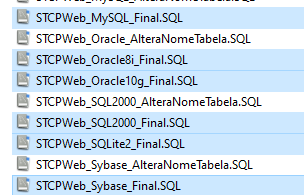
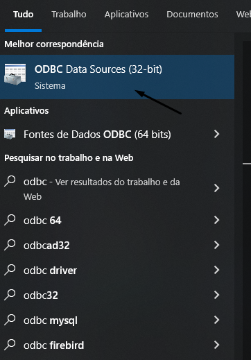
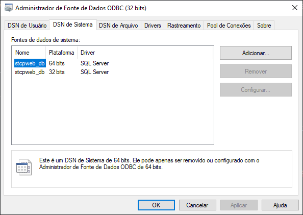
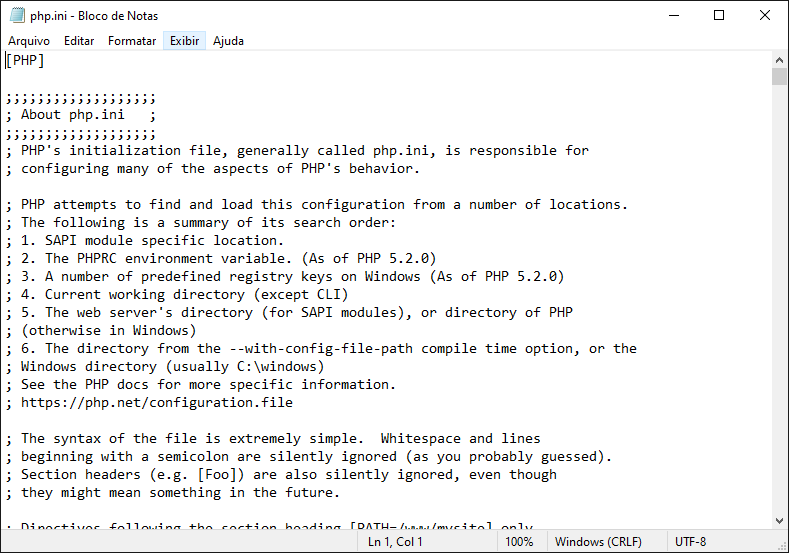

# Distribuição dos pacotes

Abra o link de instalação que será disponibilizado pela Equipe de Sustentação da Riversoft e extraia os arquivos do produto para iniciar o processo.

## Criação do Banco de Dados

O STCP OFTP Web Admin é compatível com diversos bancos de dados existentes no mercado, verifique mais informações na seção <a href="/utils/database" target="_blank">Banco de Dados homologados</a>  &nbsp;

Crie um banco de dados **STCPWEB_DB** no servidor utilizando a ferramenta adequada ao sistema.

A pasta **\<disco>:\Inetpub\wwwroot\STCPWEB_ADMIN\conf\scripts** contém os scripts para a criação das tabelas do banco de dados **STCPWEB_DB**.

<!--  -->


## Atualização da tabela TBLOperadores (SQL Server, MySQL e Oracle)

Nas versões 4.3.3 ou superiores, do STCP OFTP Web Admin, veja em <a href="/changelog/stcpadmin/" target="_blank">Changelog</a>  &nbsp;, foram implementadas diversas melhorias como: Autenticação através de LDAP, acesso às políticas de segurança e novos Registros de logs de operadores.

Para a utilização das novas versões do produto, será necessária também a atualização da tabela _TBLOPERADORES_, do banco de dados utilizado pela ferramenta, utilizando os scripts abaixo:

### SQL Server

```sql
ALTER TABLE TBLOPERADORES ADD LOGINFAILS INT NOT NULL CONSTRAINT
[TBLOPERADORES_LOGINFAILS_DEFAULT]
DEFAULT(0);
```

### MySQL

```mysql
ALTER TABLE TBLOPERADORES ADD COLUMN (LOGINFAILS DECIMAL(38,0) DEFAULT 0 NOT NULL);
```

### Oracle

```sql
ALTER TABLE TBLOPERADORES ADD (LOGINFAILS NUMBER(3,0) DEFAULT 0 NOT NULL);
```

## Driver ODBC para acesso ao Banco de Dados

Os seguintes procedimentos devem ser executados para configuração do driver ODBC de acesso ao Banco de Dados.

Acesse a ferramenta de configuração do ODBC.



Selecione a guia **DSN de Sistema** para adicionar a fonte de dados e clique em **Adicionar**.



Selecione o driver na lista e clique em **Concluir**.


Na guia **Geral**, configure as opções conforme informadas e clique no botão **OK** para salvar.

<!-- Na guia **Geral**, configure as opções conforme informadas (para Oracle8) e clique no botão **OK** para salvar. -->


Clique no botão **OK** para finalizar a configuração da fonte de dados ODBC.


## Instalação e configuração do PHP

Faça o download da última versão do processador de scripts PHP do site www.php.net e execute os passos seguintes:

Extraia o arquivo do PHP no diretório **<disco>:\php**.

Crie o diretório de controle de sessão **\<disco>:\php\sessiondata**.

Copie o arquivo **PHP-IIS.INI** do diretório **\<disco>:\STCPWEB_ADMIN\conf** para o diretório **\<disco>:\php** com o nome **PHP.INI**

Altere o arquivo **PHP.INI** com os parâmetros abaixo e salve o arquivo.



Os seguintes parâmetros devem ser alterados para refletir o ambiente de instalação:

```php {filename="PHP.INI"}
short_open_tag = On
allow_call_time_pass_reference = On
max_execution_time = 300
error_reporting = E_ALL & ~E_NOTICE
display_errors = On
register_globals = On
cgi.force_redirect =0
fastcgi.impersonate =1
cgi.rfc2616_headers = 1
include_path = ".;<disco>:\php\includes
session.save_path = "<disco>:\php\sessiondata"
session.use_cookies = 1
```

Obs: O caracter “;” (ponto e vírgula) no início da linha indica um comentário. Para os parâmetros acima o caracter deve ser removido.



