## Certificado digital emitido por uma autoridade certificadora (CA)

Veremos abaixo os procedimentos necessários para configuração do <a href="/stcpserver" target="_blank">Riversoft STCP OFTP Server</a>  e <a href="/stcpclient" target="_blank">Riversoft STCP OFTP Client</a> &nbsp; utilizando certificado emitido por uma **Autoridade Certificadora**.

### Geração da CSR

A CSR, cuja sigla significa *Certificate Signing Request*, é um arquivo de texto, gerado pelo servidor web, contendo as informações para a solicitação do seu certificado junto à entidade certificadora escolhida e usada para gerar um certificado assinado digitalmente.

A CSR conterá informações importantes da companhia e deve ser preenchida conforme instruções já encaminhadas pela entidade certificadora contratada.

A geração da CSR é divida em duas etapas:

* Geração do par de chaves (que deve ser gerada no tamanho de 2048 bits)
* Geração da CSR


Como padrão, utilizaremos o utilitário **OpenSSL** para realização do processo de geração e configuração do certificado digital.



O procedimento de geração de CSR, pode ser realizado por outro software de servidor (IIS, IBM Webshepere, iPlanet, Keytool, entre outros), conforme a infraestrutura utilizada.


### Geração do Par de Chaves

Acesse a pasta **Program** do diretório de instalação do Riversoft STCP OFTP Server (Ex. C:\STCPODT\Program) e em seguida, para gerar o par de chaves, digite a linha de comando:

```
openssl genrsa -des3 > C:\STCPODT\Keys\chaveprivada.key 2048
```
<!-- Após digitar a linha de comando, o sistema solicitará que informe uma senha para proteger o par de chaves que será criado no diretório *C:\STCPODT\Keys*. -->

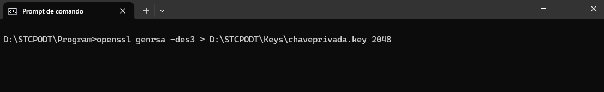
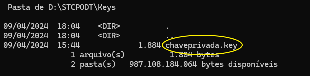

### Geração da CSR (Certificate Signing Request)

Em seguida, para gerar a requisição (CSR), utilize a linha de comando e digite as informações solicitadas.
```
openssl req -new -key C:\STCPODT\Keys\chaveprivada.key > C:\STCPODT\Keys\solicitacao.csr -config C:\STCPODT\Program\openssl.cnf
```

<!--  -->

## Solicitação do certificado SSL
A CSR, gerada no passo anterior, deverá ser encaminhada para a entidade certificadora conforme procedimentos fornecidos por essa. Para maiores dúvidas referente ao envio da CSR entre em contato com seu agente de contas junto à entidade certificadora.

Faça uma cópia de segurança de sua chave privada e do CSR, e guarde-as em local seguro. **Nenhuma cópia de sua chave privada deverá ser distribuída e/ou solicitada por terceiros.**

## Instalação e Configuração do certificado SSL

Uma vez Aprovado e Emitido, o contato técnico responsável do processo de certificação digital, receberá da entidade certificadora todas as informações pertinentes à instalação e configuração do certificado.

Para maiores dúvidas referente ao processo de instalação e configuração entre em contato com o seu agente de suporte (CA) e/ou com a sua equipe de segurança.


Este procedimento não tem como objetivo descrever o processo de instalação e configuração do certificado adquirido e sim os passos necessários para utilização desse certificado junto ao Riversoft STCP OFTP Server e Riversoft STCP OFTP Client.



## Configuração do certificado SSL no STCP OFTP Server

Para que seja possível configurar o STCP OFTP Server Enterprise/Lite, a fim de utilizar o certificado digital emitido por uma Autoridade Certificadora, será necessário possuir às **chaves pública e privada** e realizar os procedimentos descritos abaixo.

* Chave pública

Faça uma cópia da chave pública do certificado (arquivo .cer), encaminhado pela entidade certificadora, para a pasta Certs do diretório de instalação do STCP OFTP Server Enterprise/Lite (Ex. C:\STCPODT\Certs).

> NOTA: Em alguns casos o administrador precisa realizar a exportação da chave pública (*.cer) do Certificado.   Para isso, é possível utilizar o snap-in Certificados do Console de Gerenciamento Microsoft (MMC).
Para mais detalhes consulte: (https://technet.microsoft.com/pt-br/library/cc730988.aspx)

* Chave Privativa

A chave privativa (arquivo .key ou .pem) do certificado deverá ser copiada para a pasta Keys do diretório de instalação do STCP OFTP Server Enterprise/Lite (Ex. C:\STCPODT\Key).

> NOTA: Em alguns casos, onde o arquivo do certificado está no formato PFX, o processo de conversão para o formato PEM será necessário. É possível realizar a conversão usando o OpenSSL, disponível na pasta Program, do diretório de instalação do STCP OFTP Server/Lite (Ex. C:\STCPODT\Program).
<!-- Para mais detalhes consulte: (https://www.openssl.org/docs/apps/pkcs12.html) -->

```{filename="Chave Privativa"}

openssl pkcs12 -in C:\TEMP\empresateste.com.br.pfx -out C:\TEMP\private-key.pem -nodes
```
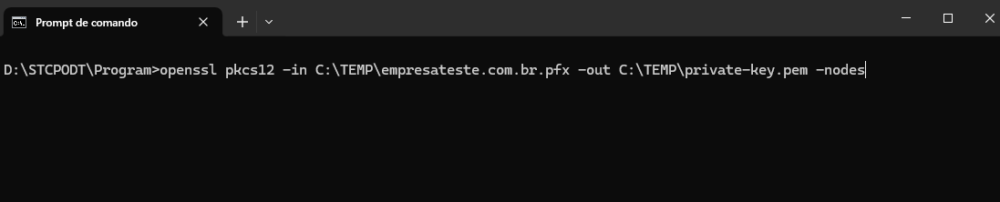

## Configuração da Rede

<span style="display:inline-block; width: 25px; height: 25px; border-radius: 50%; background-color: #0095C7; color: white; text-align: center; line-height: 25px; font-size: 14px; font-family: Arial;">1</span> &nbsp; No menu, *Iniciar > Todos os programas > Riversoft STCP OFTP Server*, acesse o **STCP OFTP Server Config**.

<span style="display:inline-block; width: 25px; height: 25px; border-radius: 50%; background-color: #0095C7; color: white; text-align: center; line-height: 25px; font-size: 14px; font-family: Arial;">2</span> &nbsp;Na guia Redes selecione a rede desejada e clique no botão Propriedades.


<span style="display:inline-block; width: 25px; height: 25px; border-radius: 50%; background-color: #0095C7; color: white; text-align: center; line-height: 25px; font-size: 14px; font-family: Arial;">3</span> &nbsp; Na janela Propriedades da rede, selecione a guia *TLS* e no grupo *Chave privativa*, informe os parâmetros *Chave e Certificado*.

> NOTA: Caso o certificado tenha sido instalado em um servidor Microsoft IIS, previamente será necessária a exportação do certificado para um arquivo PFX e a conversão desse arquivo para o formato PEM através do utilitário OpenSSL¹.


PARAMÊTROS | DESCRIÇÃO
:---       | :---
Chave      | Preencha este campo com o nome do arquivo (caminho completo) onde se encontra instalada a chave privativa.
Certificado| Preencha este campo com o nome do arquivo (caminho completo) onde se encontra o certificado digital (X509) associado à chave privativa.

<span style="display:inline-block; width: 25px; height: 25px; border-radius: 50%; background-color: #0095C7; color: white; text-align: center; line-height: 25px; font-size: 14px; font-family: Arial;">4</span> &nbsp; Pressione o botão OK para salvar e sair do STCP OFTP Server Config.

<span style="display:inline-block; width: 25px; height: 25px; border-radius: 50%; background-color: #0095C7; color: white; text-align: center; line-height: 25px; font-size: 14px; font-family: Arial;">5</span> &nbsp; Reinicie o serviço do Riversoft STCP OFTP Server para que as alterações sejam aplicadas.

## Geração do hash do certificado para uso no STCP OFTP Client

Anterior ao processo de configuração do certificado no STCP OFTP Client, será necessária obter uma cópia da cadeia de certificados, a partir do certificado assinado e enviado pela entidade certificadora e o realizar o renomeio de cada certificado dessa hierarquia para o seu hash correspondente.

<span style="display:inline-block; width: 25px; height: 25px; border-radius: 50%; background-color: #0095C7; color: white; text-align: center; line-height: 25px; font-size: 14px; font-family: Arial;">1</span> &nbsp; Faça uma cópia do certificado, encaminhado pela certificadora, para um diretório temporário do servidor onde o STCP OFTP Server está instalado (Ex. C:\TEMP)

<span style="display:inline-block; width: 25px; height: 25px; border-radius: 50%; background-color: #0095C7; color: white; text-align: center; line-height: 25px; font-size: 14px; font-family: Arial;">2</span> &nbsp; Acesso o diretório temporário e clique com o botão direito do mouse no certificado (Ex. empresateste_certificate.cer) e selecione **Abrir**

<span style="display:inline-block; width: 25px; height: 25px; border-radius: 50%; background-color: #0095C7; color: white; text-align: center; line-height: 25px; font-size: 14px; font-family: Arial;">3</span> &nbsp; Na guia Caminho de Certificação selecione o certificado raíz (Ex. VeriSign Trial Secure Server Root CA – G2) e clique no botão Exibir Certificado.

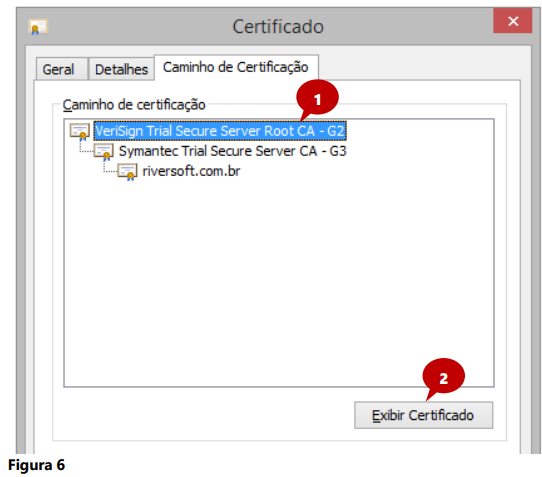

<span style="display:inline-block; width: 25px; height: 25px; border-radius: 50%; background-color: #0095C7; color: white; text-align: center; line-height: 25px; font-size: 14px; font-family: Arial;">4</span> &nbsp; Uma nova janela será exibida, contendo as informações do certificado selecionado (neste exemplo serão exibidas as informações do certificado raiz _VeriSign Trial Secure Server Root CA – G2)_

<span style="display:inline-block; width: 25px; height: 25px; border-radius: 50%; background-color: #0095C7; color: white; text-align: center; line-height: 25px; font-size: 14px; font-family: Arial;">5</span> &nbsp; Selecione a guia **Detalhes** e clique no botão **Copiar para Arquivo** para iniciar o Assistente para Exportação de Certificados

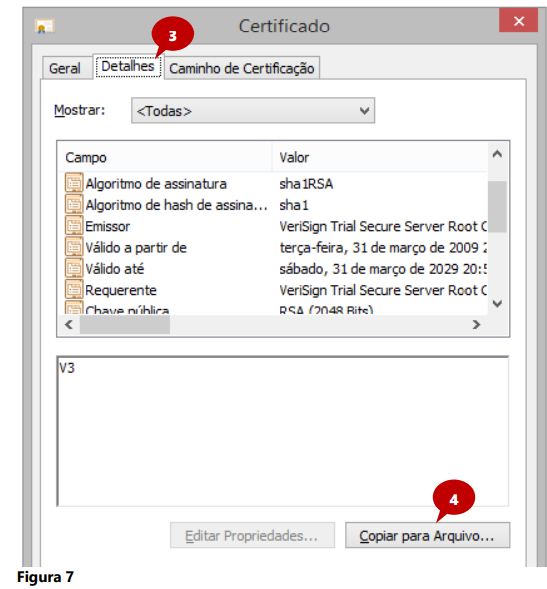

<span style="display:inline-block; width: 25px; height: 25px; border-radius: 50%; background-color: #0095C7; color: white; text-align: center; line-height: 25px; font-size: 14px; font-family: Arial;">6</span> &nbsp; Para continuar, clique em **Avançar**

<span style="display:inline-block; width: 25px; height: 25px; border-radius: 50%; background-color: #0095C7; color: white; text-align: center; line-height: 25px; font-size: 14px; font-family: Arial;">7</span> &nbsp; No formato do arquivo de exportação selecione *X.509 codificado na base 64 (*.cer)* e clique no botão **Avançar**

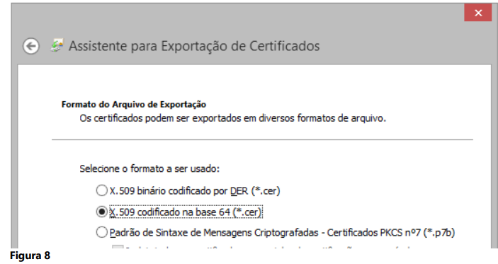

<span style="display:inline-block; width: 25px; height: 25px; border-radius: 50%; background-color: #0095C7; color: white; text-align: center; line-height: 25px; font-size: 14px; font-family: Arial;">8</span> &nbsp; Informe o caminho e nome do arquivo a ser exportado (Ex. C:\TEMP\root_certificate.cer)

<span style="display:inline-block; width: 25px; height: 25px; border-radius: 50%; background-color: #0095C7; color: white; text-align: center; line-height: 25px; font-size: 14px; font-family: Arial;">9</span> &nbsp; Para finalizar, clique no botão **Concluir**

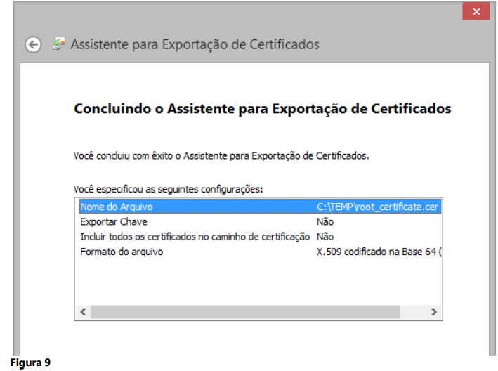

<span style="display:inline-block; width: 25px; height: 25px; border-radius: 50%; background-color: #0095C7; color: white; text-align: center; line-height: 25px; font-size: 14px; font-family: Arial;">10</span> &nbsp; Repita os passos de 3 a 9 para os exportar os demais certificados existentes na hierarquia de certificados, o certificado raiz (G2) e o intermediário (G3).

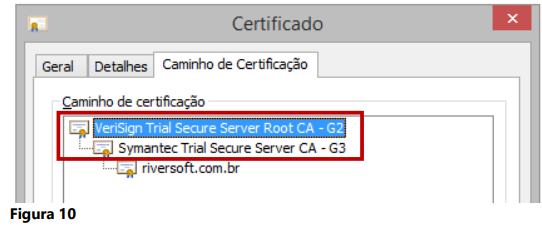

> NOTA: Neste exemplo serão gerados mais dois arquivos no diretório temporário (Ex. root_certificate.cer e intermediate_certificate.cer).

<span style="display:inline-block; width: 25px; height: 25px; border-radius: 50%; background-color: #0095C7; color: white; text-align: center; line-height: 25px; font-size: 14px; font-family: Arial;">11</span> &nbsp; Acesse a pasta *Program* do diretório de instalação do Riversoft STCP OFTP Server (Ex. C:\STCPODT\Program) e em seguida, para gerar o _hash_, digite a linha de comando:

```
openssl x509 –noout –hash -in C:\TEMP\root_certificate.cer
```
<!--  -->

<span style="display:inline-block; width: 25px; height: 25px; border-radius: 50%; background-color: #0095C7; color: white; text-align: center; line-height: 25px; font-size: 14px; font-family: Arial;">12</span> &nbsp; Uma vez obtido o _hash_ do arquivo indicado, renomeie esse arquivo para o seu _hash_ correspondente e mais a extensão .**0** (Ex. _root_certificate.cer para F877295a.0_)

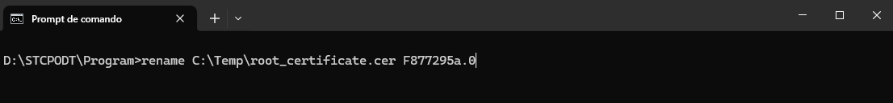

<span style="display:inline-block; width: 25px; height: 25px; border-radius: 50%; background-color: #0095C7; color: white; text-align: center; line-height: 25px; font-size: 14px; font-family: Arial;">13</span> &nbsp; Repita os passos 11 e 12 para realizar o renomeio dos demais arquivos exportados *(Ex. _root_certificate.cer e intermediate_certificate.cer_)*

<!--  -->

<span style="display:inline-block; width: 25px; height: 25px; border-radius: 50%; background-color: #0095C7; color: white; text-align: center; line-height: 25px; font-size: 14px; font-family: Arial;">14</span> &nbsp; Copie os arquivos renomeados para a pasta Certs do diretório de instalação do STCP OFTP Client *(Ex. C:\STCPCLT\Certs)*

## Configuração do certificado SSL no STCP OFTP Client

<span style="display:inline-block; width: 25px; height: 25px; border-radius: 50%; background-color: #0095C7; color: white; text-align: center; line-height: 25px; font-size: 14px; font-family: Arial;">1</span> &nbsp; No menu, *Iniciar > Todos os programas > Riversoft STCP OFTP Client*, acesse o *STCP OFTP Client Config*.

<span style="display:inline-block; width: 25px; height: 25px; border-radius: 50%; background-color: #0095C7; color: white; text-align: center; line-height: 25px; font-size: 14px; font-family: Arial;">2</span> &nbsp; Na guia Perfis selecione o perfil desejado e clique no botão **Propriedades**

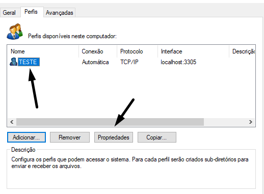

<span style="display:inline-block; width: 25px; height: 25px; border-radius: 50%; background-color: #0095C7; color: white; text-align: center; line-height: 25px; font-size: 14px; font-family: Arial;">3</span> &nbsp; Na janela Propriedades do perfil, na guia **Geral**, clique no botão **Configurar** e selecione a guia **TLS (Openssl)**

<span style="display:inline-block; width: 25px; height: 25px; border-radius: 50%; background-color: #0095C7; color: white; text-align: center; line-height: 25px; font-size: 14px; font-family: Arial;">4</span> &nbsp; No grupo Certificados CA (Autoridades) informe o parâmetro Diretório.

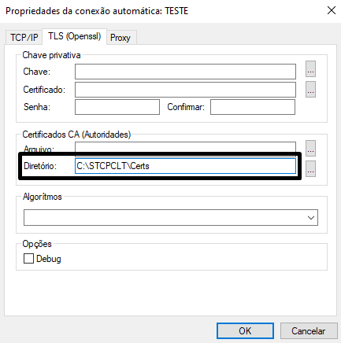

PARAMÊTROS | DESCRIÇÃO
:---       | :---
Diretório  | Preencha este campo com o nome do diretório (caminho completo) onde se encontram instalados os certificados digitais (X509) contendo a chave pública que assina o certificado apresentado pelo servidor.

<span style="display:inline-block; width: 25px; height: 25px; border-radius: 50%; background-color: #0095C7; color: white; text-align: center; line-height: 25px; font-size: 14px; font-family: Arial;">5</span> &nbsp; Pressione o botão OK para salvar e sair do *STCP OFTP Client Config*

<span style="display:inline-block; width: 25px; height: 25px; border-radius: 50%; background-color: #0095C7; color: white; text-align: center; line-height: 25px; font-size: 14px; font-family: Arial;">6</span> &nbsp; Realize os testes de conexão ao *STCP OFTP Server* através do *STCP OFTP Client*


