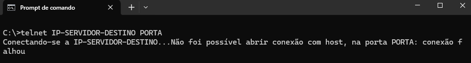

## Telnet

Em alguns casos, para que seja possível a identificação de problemas relacionados à conexão e a troca de arquivos, utilizando o STCP OFTP Server/Client, se faz necessário à realização de testes de conectividade entre as partes envolvidas no processo de transferência.

Quando a conexão é estabelecida através de uma porta de comunicação sem o uso de certificado de segurança (TLS), siga os passos descritos abaixo:

Acesse o prompt de comando do Windows *(a execução deverá ser sem as credenciais de Administrador)*.

Execute o comando abaixo e pressione `ENTER`

```
telnet <IP-SERVIDOR-DESTINO> <PORTA>
```

> [!WARNING] Aviso: 
> Nos parâmetros IP-SERVIDOR-DESTINO e PORTA deverão ser informados o IP e Porta respectivos ao servidor do parceiro, no qual a conexão será realizada.


> [!NOTE] Aviso
> Obs.: Antes de realizar o teste com o Telnet, verifique se o mesmo encontra-se instalado em seu sistema operacional. Em caso de dúvidas consulte o seu administrador de rede.

Caso a conexão seja estabelecida com sucesso, a tela abaixo deverá ser exibida. Observe que para haver sucesso no teste de conectividade, a mensagem **ODETTE FTP READY** deverá ser exibida conforme a imagem de exemplo abaixo.


Caso o teste retorne falha na conexão (vide exemplo abaixo), por favor, verifique com a área de infraestrutura de rede se não existe nenhum bloqueio (Firewall/Proxy) na comunicação.

É importante validar a liberação das conexões de saída (lado parceiro) e conexões de entrada (lado servidor), para o IP e Portas utilizados.

A mensagem de erro poderá variar conforme o problema existente na conectividade. Veja um exemplo abaixo no caso de erro.



> [!CAUTION] Atenção
> Em caso de dúvidas na execução deste processo, consulte o seu administrador de rede.

## OpenSSL

Em alguns casos, para que seja possível a identificação de problemas relacionados à conexão e a troca de arquivos, utilizando o STCP OFTP Server/Client, se faz necessário à realização de testes de conectividade entre as partes envolvidas no processo de transferência.

Quando a conexão é estabelecida através de uma porta de comunicação segura (TLS), siga os passos descritos abaixo:

Efetue o download da ferramenta OpenSSL através do link: [Download Openssl](http://www.riversoft.com.br/produtos/pub/stcp-openssl.zip)

Copie o arquivo openssl.exe para o diretório `C:/Temp` (ou outro de sua preferencia).

Acesse o prompt de comando do Windows *(a execução deverá ser sem as credenciais de Administrador)*.

No diretório C:/Temp execute o comando openssl.exe.

> [!WARNING] Aviso: 
> Nos parâmetros IP-SERVIDOR-DESTINO e PORTA deverão ser informados o IP e Porta respectivos ao servidor do parceiro, no qual a conexão será realizada.

Após acesso ao OpenSSL, execute a linha de comando abaixo:

```
s_client -host <IP-SERVIDOR-DESTINO> -port <PORTA> –debug
```


<!--  -->

A tela a seguir deverá ser apresentada em caso de sucesso. Observe que para haver sucesso no teste de conectividade, a mensagem **ODETTE FTP READY** deverá ser exibida conforme a imagem de exemplo abaixo.


Caso o teste retorne falha na conexão, por favor, verifique com a área de infraestrutura de rede se não existe nenhum bloqueio (Firewall/Proxy) na comunicação.

É importante validar a liberação das conexões de saída (lado parceiro) e conexões de entrada (lado servidor), para o IP e Portas utilizados.

A mensagem de erro poderá variar conforme o problema existente na conectividade.

> [!CAUTION] Atenção
> Em caso de dúvidas na execução deste processo, consulte o seu administrador de rede.

