## O que é?

O STCPConsole é um sistema que tem como principal funcionalidade permitir que sejam realizadas
atividades de monitoração de um determinado servidor. Estas atividades envolvem a **monitoração de
usuários** (monitora todos os usuários ativos) e a **monitoração de eventos** (monitora todos os eventos do
servidor).

Características Gerais:

* Monitoração de usuários
* Adição e remoção de servidores
* Adição e remoção de visões
* Conexão com usuários

## Funcionalidades
Dentre as principais funcionalidades deste módulo, podemos citar: adição e remoção de servidores e
visões, monitoração de usuários e/ou eventos, e conexão com usuários.

## Configuração

Esta é a tela inicial da aplicação. Através dela é possível adicionar e remover servidores, adicionar e
remover visões, monitorar usuários e eventos, etc.

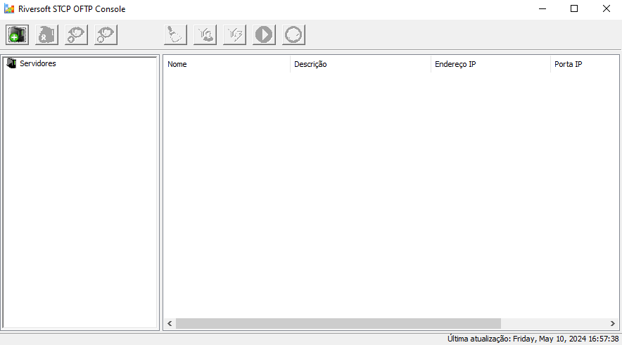

### Adicionar um servidor

1 &nbsp;Para adicionar um servidor, clique no botão **Adicionar Servidor** (imagem abaixo).

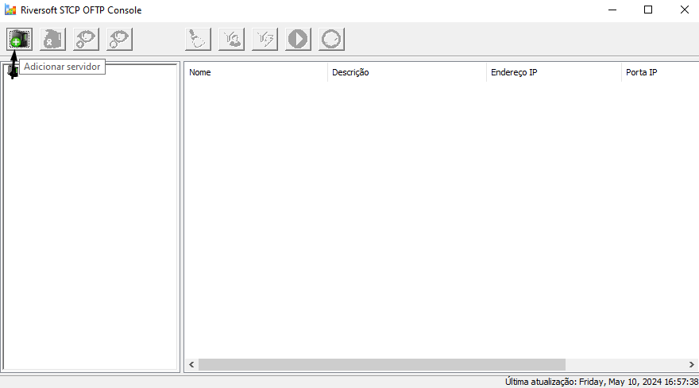

2 &nbsp;Na guia **Geral**, preencha os parâmetros:

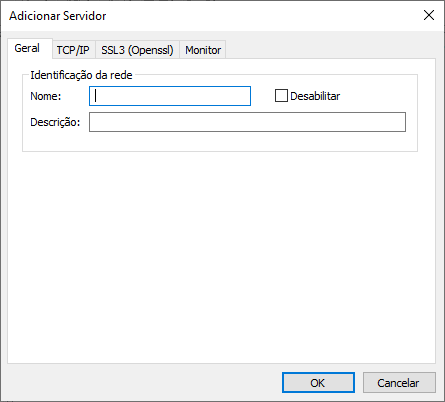

| Parâmetro      | Descrição |
| :-----------: | :-----------: |
| Nome          | Campo com o nome do servidor.|
| Descrição     | Descrição do servidor que está sendo adicionado. |
| Desabilitar   | Esta opção habilita/desabilita o servidor.|

3 &nbsp;Na guia **TCP/IP**, preencha os parâmetros:

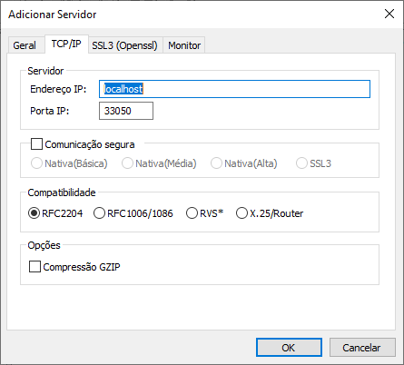

| Parâmetro      | Descrição |
| ----------- | ----------- |
| Endereço IP | Campo com o endereço TCP/IP ou nome (DNS) do servidor.|
| Porta       | Campo com a porta IP usada pelo servidor. |
| Comunicação segura | Esta opção habilita ou inibe a utilização de criptografia na comunicação com o servidor.  **Nativa(Básica):** configura a comunicação segura com criptografia com nível de segurança básico.  **Nativa (Média):** configura a comunicação segura com criptografia com nível de segurança médio.   **Nativa (Alta):** configura a comunicação segura com criptografia com nível de segurança alto.   **SSL3:** configura a comunicação segura com criptografia e certificação digital, com a utilização da padronização definida na RFC2246 (TLS1/SSL3). O TLS1/SSL3 é comumente encontrado nos servidores de sites seguros (HTTPS) e oferece o maior grau de segurança atualmente disponível. |


Obs.: antes de habilitar uma destas opções de comunicação, confirme se o servidor com quem você deseja se comunicar suporta esta característica.


| Parâmetro      | Descrição |
| ----------- | ----------- |
| Compatibilidade | Esta opção possibilita compatibilizar o servidor com diferentes produtos atualmente existentes no mercado.  **RFC2204:** esta opção de compatibilidade permite a comunicação do servidor com outros produtos que seguem a recomendação RFC2204.  **RFC1006/1086:** esta opção de compatibilidade permite a comunicação do servidor através de gateways de comunicação TCP-IP/X.25, que seguem a recomendação RFC1006/1086.  **RVS\*:** esta opção de compatibilidade permite que a comunicação do servidor com o produto RVS*. **X.25/Router:** esta opção de compatibilidade permite a comunicação do servidor através de roteadores com suporte a comunicação X.25 através de socket.|


Obs.: a opção Compatibilidade não deve ser habilitada quando o servidor RVS* for uma versão do mainframe (grande porte).



  *As marcas citadas acima são propriedade dos seus respectivos donos.


| Parâmetro      | Descrição |
| ----------- | ----------- |
| Compressão GZIP | Esta opção habilita ou inibe a utilização da compressão GZIP on-the-fly (durante a transferência).|
| Porta       | Campo com a porta IP usada pelo servidor. |


Obs: antes de habilitar a opção Compressão GZIP, confirme se o servidor com quem você deseja se
comunicar suporta esta característica.


4 &nbsp;Na guia **SSL3(Openssl)**, preencha os parâmetros:

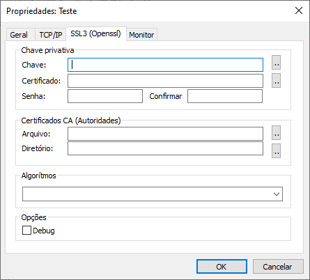

| Parâmetro      | Descrição |
| ----------- | ----------- |
| Chave privativa | As opções deste grupo estão relacionadas às chaves pública e privada, utilizadas pelo protocolo TLS1/SSL3 para autenticação e criptografia dos dados.|
| Chave       | Campo com o nome do arquivo (caminho completo) onde se encontra instalada a chave privativa. |
| Certificado       | Campo com o nome do arquivo (caminho completo) onde se encontra instalado o certificado digital (X509) associado à chave privativa. |
| Senha              | Campo com a senha que protege o arquivo da chave privativa. |
| Confirmar          | Campo com a senha informada no campo **senha** para validação. |
| Comunicação segura | Esta opção habilita ou inibe a utilização de criptografia na comunicação com o servidor. |
| Porta IP       | Campo com a porta IP usada pelo servidor. |
| Nativa (Básica)       | Configura a comunicação segura com criptografia com nível de segurança básico. |
| Nativa (Média)       |  Configura a comunicação segura com criptografia com nível de segurança médio. |
| Nativa (Alta)       | Configura a comunicação segura com criptografia com nível de segurança alto. |
| SSL3       | Configura a comunicação segura com criptografia e certificação digital, com a utilização da padronização definida na RFC2246 (TLS1/SSL3). O TLS1/SSL3 é comumente encontrado nos servidores de sites seguros (HTTPS) e oferece o maior grau de segurança atualmente disponível. |


Obs.: o arquivo da chave privativa deve estar no formato PKCS#12 e os certificados no formato DER ou PEM.


| Parâmetro      | Descrição |
| ----------- | ----------- |
| Certificado CA (Autoridades)      | As opções deste grupo estão relacionadas aos certificados digitais das autoridades certificadoras (CA) que servirão para validar a autenticidade do certificado apresentado pelo servidor. |
| Arquivo   | Preencha este campo com o nome do arquivo (caminho completo) onde se encontra instalado o certificado digital (X509) contendo a chave pública que assina o certificado apresentado pelo servidor. |
| Diretório | Preencha este campo com o nome do diretório (caminho completo) onde se encontram instalados os certificados digitais (X509) contendo a chave pública que assina o certificado apresentado pelo servidor.|


Obs.: o arquivo da chave privativa deve estar no formato PKCS#12 e os certificados no formato DER ou PEM.


| Parâmetro   | Descrição |
| ----------- | ----------- |
| Algoritmos  | Campo com os nomes dos algoritmos suportados para assinatura digital, hashing e criptografia dos dados.   Obs.: caso este campo não seja configurado, o protocolo TSL será selecionado automaticamente.|
| Debug  | Esta opção permite criar um arquivo de depuração. |

5 &nbsp; Na guia **Monitor**, preencha os parâmetros:

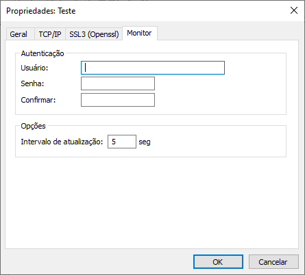

| Parâmetro   | Descrição |
| ----------- | ----------- |
| Usuário  | Campo com o nome do usuário habilitado para realizar a monitoração. |
| Senha  | Campo com a senha do usuário de monitoração. |
| Confirmar  | Campo com a senha informada no campo **senha** para validação. |
| Intervalo de atualização  | Campo com o intervalo mínimo de atualização das listas de monitoração. |

6 &nbsp;Depois de definidos todos os parâmetros do novo servidor, clique no botão **OK** para que as informações do novo servidor sejam salvas. Após isso, o novo servidor deve aparecer na árvore de servidores, e caso ele esteja selecionado, suas informações devem ser exibidas na lista ao lado.

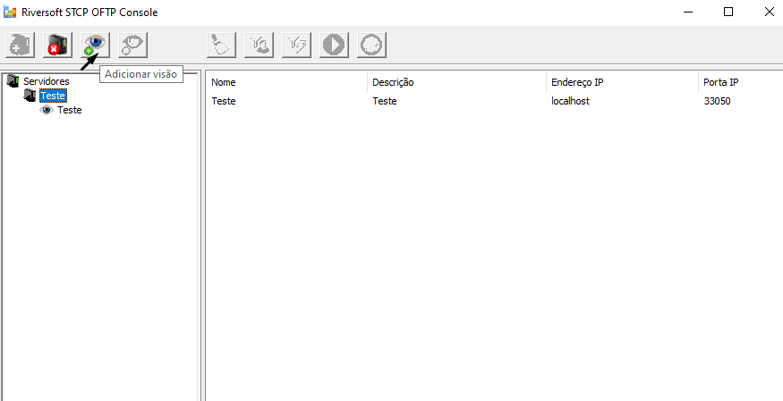

Toda vez que um servidor é adicionado na aplicação, uma visão default é adicionada com ele. Para visualizar esta visão, basta expandir o ícone do servidor e a visão será exibida (veja imagem acima), se a visão estiver selecionada, suas informações serão exibidas na lista ao lado.


Obs.: esta visão pode ser editada de acordo com as necessidades do usuário.


### Como adicionar uma visão

1 &nbsp;Para adicionar uma visão, clique no botão **Adicionar Visão**

| Parâmetro   | Descrição |
| ----------- | ----------- |
| Nome  | Campo com o nome da visão. |
| Descrição  | Campo com a descrição da visão que está sendo adicionada. |
| Filtro de usuário  | Campo com um filtro de usuário. Este filtro será usado para **Monitorar Usuários** e para **Iniciar Conexão**. |
| Filtro de eventos  | Campo com um filtro de eventos. Este filtro será usado para **Monitorar Eventos**. |
| Nº. de linhas  | preencha este campo com a quantidade de linhas que deseja visualizar na monitoração. |

2 &nbsp;Depois de definir os parâmetros da nova visão, clique no botão **OK** para que as informações sejam salvas. A nova visão deve aparecer na árvore de servidores, abaixo do nome do servidor.

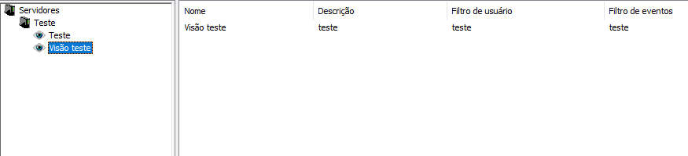

### Como editar os dados de um servidor

1 &nbsp;Para editar os dados de um servidor, clique sobre o nome do servidor desejado com o botão direito do mouse e escolha a opção **Propriedades**.

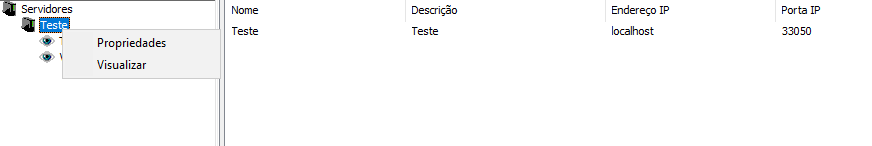

A tela para edição dos dados do servidor é exibida. O campo onde se define o nome do servidor aparece bloqueado, pois não pode ser editado. À exceção deste campo, todos os outros podem ser alterados.

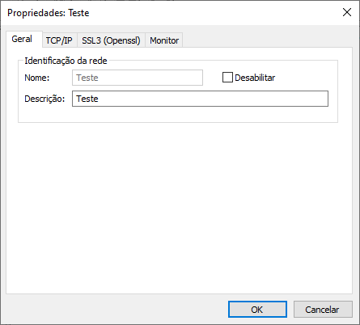


Obs.: para ter mais detalhes sobre a definição dos campos, ver seção [**Adicionar Servidor**](#adicionar-um-servidor)


### Como visualizar os dados de um servidor

1 &nbsp;Para visualizar os dados de um servidor, clique sobre o nome do servidor desejado com o botão direito do mouse e escolha a opção **Visualizar**.

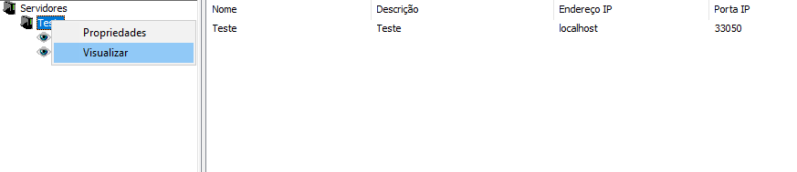

A tela de visualização dos dados do servidor será exibida. Todos os campos aparecerão bloqueados, sendo permitida somente a visualização dos valores dos campos.

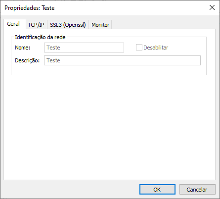

### Como editar os dados de uma visão

1 &nbsp;Para editar os dados de uma visão, clique sobre o nome da visão desejada com o botão direito do mouse e escolha a opção **Editar**

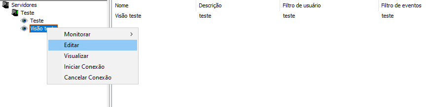

A tela para edição dos dados da visão é exibida. O campo onde se define o nome da visão aparece bloqueado, pois não pode ser editado. À exceção deste campo, todos os outros podem ser alterados.

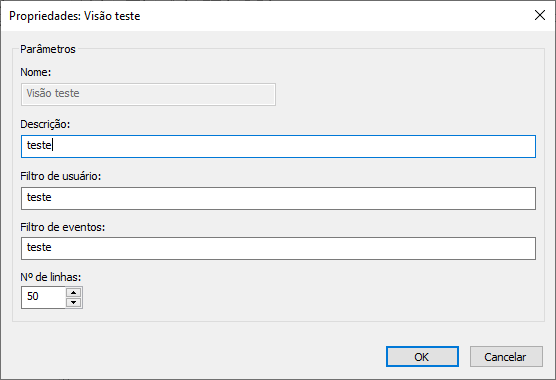


Obs.: para ter mais detalhes sobre a definição dos campos, ver seção [**Adicionar Visão**](#como-adicionar-uma-visão).


### Como visualizar os dados de uma visão

1 &nbsp;Para visualizar os dados de uma visão, clique sobre o nome da visão desejada com o botão direito do mouse e escolha a opção **Visualizar**.

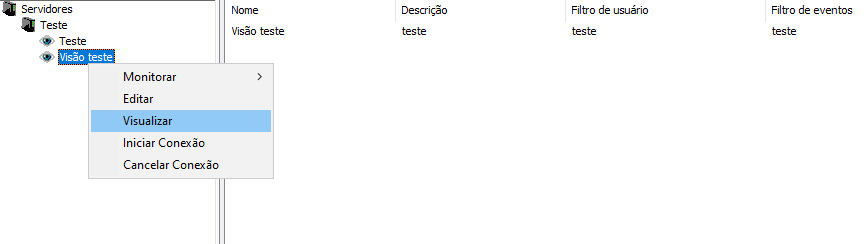

A tela de visualização dos dados da visão será exibida. Todos os campos aparecerão bloqueados, sendo permitida somente a visualização dos valores.

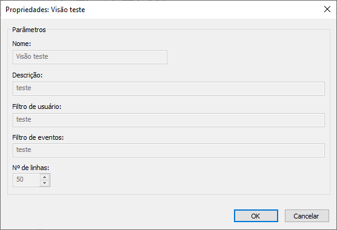

### Como remover um servidor

1 &nbsp;Para remover um servidor, selecione o servidor desejado na árvore e clique sobre o botão **Remover Servidor**.

Para evitar remoções indesejadas, é solicitado ao usuário que confirme o procedimento. Para confirmar a remoção do servidor, clique sobre o botão **Sim** e o servidor será removido

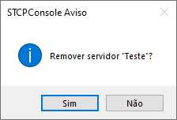

### Como remover uma visão
1 &nbsp; Para remover uma visão, selecione a visão desejada na árvore e clique sobre o botão **Remover Visão**.

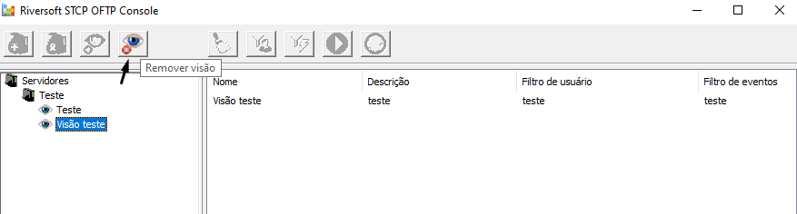

Para evitar remoções indesejadas, é solicitado ao usuário que confirme o procedimento. Para confirmar a remoção da visão, clique sobre o botão **Sim** e a visão será removida.

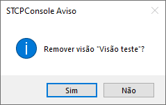

### Como monitorar usuários

A monitoração de usuários permite que sejam monitorados todos os usuários ativos no servidor. Este tipo de monitoração leva em conta o filtro de usuário definido na visão, portanto só serão exibidos os usuários que passarem por esse filtro.

1 &nbsp;Para realizar a monitoração de usuários, clique com o botão direito do mouse sobre a visão desejada e escolha a opção **Monitorar → Usuário**.

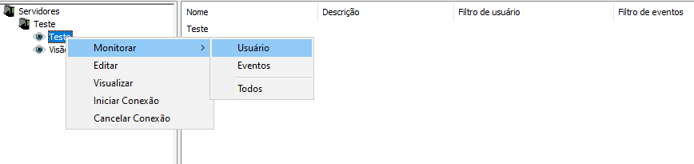

A lista de monitoração de usuários exibirá as informações dos usuários ativos do servidor que passarem pelo filtro. A atualização da lista ocorrerá de acordo com o intervalo de tempo definido no parâmetro **Intervalo de atualização** que se encontra na guia **Monitor**, nas propriedades do servidor.

Quando a monitoração de usuários é ativada, alguns botões são habilitados permitindo as seguintes
funções:

| Funções   | Descrição |
| ----------- | ----------- |
| Limpar mensagens | Esta função permite apagar as mensagens da lista de monitoração. Para fazer uso desta funcionalidade, basta clicar sobre o botão **Limpar Mensagens**. |
| Definir filtro de usuário | Esta função permite definir um filtro de usuário mais externo, que será usado somente durante esta monitoração. Primeiro, as informações dos usuários são comparadas com o filtro de usuário definido na visão, e em seguida, são comparadas com este filtro. |

Para fazer uso desta funcionalidade, clique sobre o botão **Filtro de Usuário**. Será exibida a tela onde o usuário deve definir o filtro, em seguida, clique no botão **OK** para que a monitoração seja atualizada com o novo filtro.

<!-- Para fazer uso desta funcionalidade, clique sobre o botão **Filtro de Usuário**. Será exibida a tela onde o usuário deve definir o filtro (como mostra a imagem seguinte), em seguida, clique no botão “OK” para que a monitoração seja atualizada com o novo filtro. -->

| Funções   | Descrição |
| ----------- | ----------- |
| Parar monitoração | Esta função permite parar a atividade de monitoração. Para fazer uso desta funcionalidade, basta clicar sobre o botão **Parar**. |
| Iniciar monitoração | Esta função permite iniciar a atividade de uma monitoração que foi parada. Para
fazer uso desta funcionalidade, basta clicar sobre o botão **Iniciar**. |

### Como monitorar eventos

A monitoração de eventos permite que sejam monitorados todos os eventos do servidor. Este tipo de monitoração leva em conta os parâmetros definidos na visão: **Filtro de eventos** (só serão exibidos os eventos que passarem por este filtro) e **Nº. de linhas** (define a quantidade de eventos exibidos).

1 &nbsp;Para realizar a monitoração de eventos, clique com o botão direito do mouse sobre a visão desejada e escolha a opção **Monitorar → Eventos**

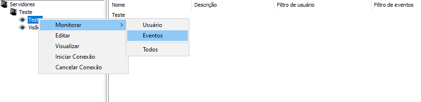

A lista de monitoração de eventos exibirá as informações dos eventos do servidor que passarem pelo filtro. A atualização da lista ocorrerá de acordo com o intervalo de tempo definido no parâmetro **Intervalo de atualização** que se encontra na guia **Monitor**, nas propriedades do servidor.

Quando a monitoração de eventos é ativada, alguns botões são habilitados permitindo as seguintes funções:

| Funções   | Descrição |
| ----------- | ----------- |
| Limpar mensagens | Esta função permite apagar as mensagens da lista de monitoração. Para fazer uso desta funcionalidade basta clicar sobre o botão **Limpar Mensagens**. |
| Definir filtro de eventos | Esta função permite definir um filtro de eventos mais externo que será usado somente durante esta monitoração. Primeiro, as mensagens de eventos são comparadas com o filtro de eventos definido na visão, e em seguida, são comparadas com este filtro. Este filtro permite também, que seja definida a quantidade de mensagens a ser exibida no parâmetro **Nº. de linhas**. |


Obs.: quando se define o filtro de eventos, a aplicação passa a ter como parâmetro de quantidade de
mensagens o que for definido no parâmetro “Nº. de linhas” do filtro de eventos e não da visão.


2 &nbsp; Para fazer uso desta funcionalidade, clique sobre o botão **Filtro de Eventos**. Será exibida a tela onde o usuário deve definir o filtro e a quantidade de mensagens de eventos, em seguida, clique no botão **OK** para que a monitoração seja atualizada com as novas informações.

<!-- Para fazer uso desta funcionalidade, clique sobre o botão **Filtro de Eventos**. Será exibida a tela onde o usuário deve definir o filtro e a quantidade de mensagens de eventos (como mostra a imagem abaixo), em seguida, clique no botão **OK** para que a monitoração seja atualizada com as novas informações. -->

| Funções   | Descrição |
| ----------- | ----------- |
| Parar monitoração | Esta função permite parar a atividade de monitoração. Para fazer uso desta funcionalidade, basta clicar sobre o botão **Parar**. |
| Iniciar monitoração | Esta função permite iniciar a atividade de uma monitoração que foi parada. Para fazer uso desta funcionalidade, basta clicar sobre o botão **Iniciar**. |

### Como monitorar usuários e eventos

A monitoração de usuários e eventos permite que sejam monitorados ao mesmo tempo os usuários ativos e os eventos do servidor.

1 &nbsp;Para realizar a monitoração de usuários e eventos, clique com o botão direito do mouse sobre a visão desejada e escolher a opção **Monitorar → Todos**.

As listas de monitoração de usuários e eventos exibirão as informações dos usuários ativos e dos eventos, respectivamente. Para mais detalhes sobre cada tipo de monitoração, veja seções [**Monitorando Usuários**](#como-monitorar-usuários) e [**Monitorando Eventos**](#como-monitorar-eventos).

### Como iniciar conexão com um usuário

1 &nbsp;Para iniciar uma conexão com um usuário, clique sobre o nome da visão desejada com o botão direito do mouse e escolha a opção **Iniciar Conexão**, como mostra a imagem.

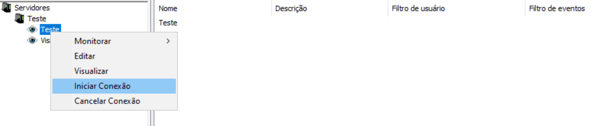

2 &nbsp;Informe o usuário:

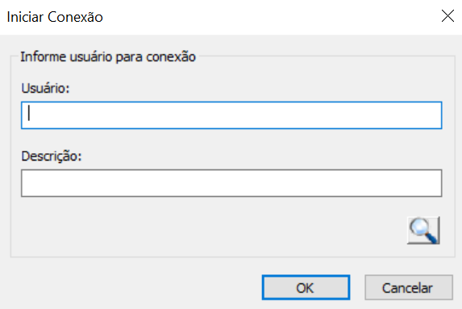

| Parâmetro   | Descrição |
| ----------- | ----------- |
| Usuário | Campo com o nome do usuário com o qual se deseja estabelecer uma conexão.   Obs.: caso não se tenha certeza do nome do usuário, coloque parte do nome nesse campo e clique no botão **Procurar Usuário**. |
| Descrição | Este campo facilita a procura de um usuário. Preencha este campo com a descrição completa ou parcial do nome do usuário desejado e clique no botão **Procurar Usuário**. |
| Botão **Procurar usuário** | Este botão permite que se tenha acesso a lista de usuários disponíveis para a conexão automática. |

Quando este botão for acionado, serão listados apenas os usuários que se encaixarem dentro das informações definidas nos parâmetros **Usuário** e **Descrição**. Caso estes parâmetros não tenham sido preenchidos, serão listados todos os usuários.

Exemplo: se o nome de um usuário é desconhecido, mas se sabe que a descrição deste contém a palavra “teste”, preencha o parâmetro **Descrição** com o valor “teste” e serão listados apenas os usuários que tenham essa informação na descrição. Este procedimento facilita a procura, já que permite refinar a lista de resultados.

3 &nbsp;Nesta tela, selecione o usuário desejado e clique no botão **OK**, ou então, dê um clique duplo sobre o nome do usuário e automaticamente esse nome irá para o parâmetro **“Usuário”**.

Após informar o nome do usuário para conexão no parâmetro **Usuário**, clique no botão **OK** para que seja estabelecida a conexão.

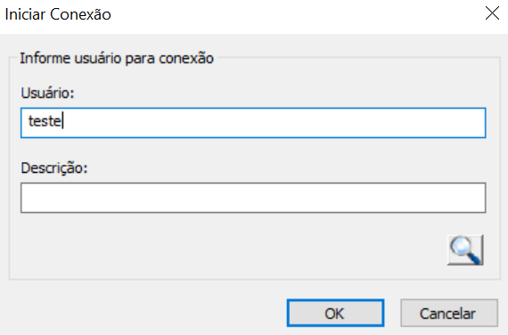

Após informar o nome do usuário para conexão no parâmetro **Usuário** e clicar sobre o botão **OK** para que seja estabelecida a conexão, é exibida a lista de monitoração. No topo da lista, ficam as mensagens de retorno da conexão com o usuário.


Obs.: a conexão automática deve estar habilitada no usuário para que se tenha sucesso nessa operação.


## Glossário

**D**

*DER* É um padrão de codificação que fornece um método de codificação de objetos (como certificados e mensagens), independente de plataforma, para transmissão entre dispositivos e aplicativos.

**E**

*Endereço IP*
Este endereço é um número único para cada computador conectado a Internet, composto por uma seqüência de 4 números que variam de 0 até 255, separados por “.”.

**P**

*PEM*
Privacy Enhanced Mail é um formato popular de certificado.

*PKCS#12* Um formato de arquivo que transporta certificados e chaves confidenciais.

**S**

*SSL* Do Inglês Secure Sockets Layer. Protocolo que fornece confidencialidade e integridade na comunicação entre um cliente e um servidor, através do uso de criptografia.
