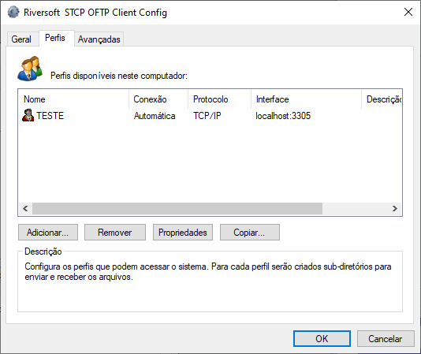

# Configurar um servidor proxy para conexão

1 &nbsp; Acesse o *Riversoft STCP OFTP Client Config*: *(Iniciar -> Todos os programas -> Riversoft STCP OFTP Client)*

2 &nbsp; Selecione o perfil desejado na guia **Perfis** e clique em **Propriedades**.

3 &nbsp; Na guia **Geral**, clique no botão **Configurar**.

4 &nbsp; Na guia **Proxy**

Clique no botão **Lê Configuração Proxy do IE** para obter as informações do navegador Internet Explorer. Caso o servidor Proxy utilize autenticação, preencha-as.


Autenticação Basic é comumente utilizada com servidores Squid, Wingate e outros.
Autenticação NTLM é comumente utilizada com servidores ISA, MS-Proxy.


**Notas:**

  Algumas configurações de autenticação requerem a informação do servidor de
  domínio (quando aplicável) no seguinte padrão: (Nomedodomínio) \ (Usuário do
  domínio).



  Nos casos em que houver alteração da senha do usuário do domínio, a senha do
  STCP OFTP Client também deverá ser alterada.


