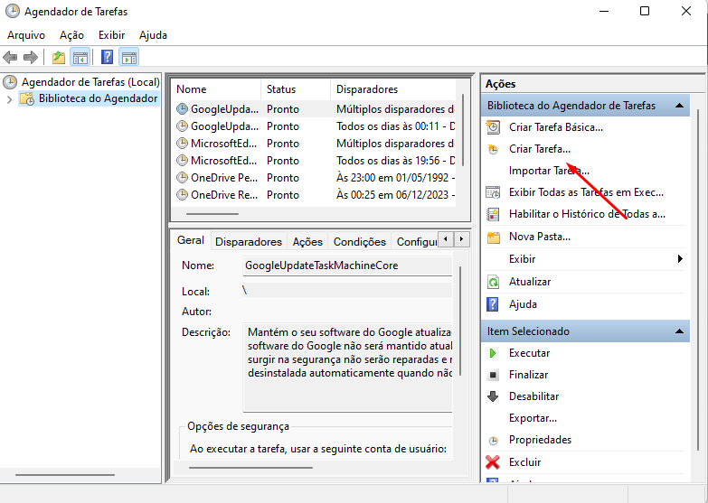

# Configurar um agendamento

Nesta seção veremos como configurar a execução automática do Riversoft STCP OFTP Client no **Windows** e **Windows Server**.

Para executar automaticamente a aplicação de transferência de arquivos, devemos realizar os seguintes passos de configuração das tarefas agendadas do sistema operacional:

&nbsp; Acesse o **Agendador de Tarefas** dentro de **Ferramentas Administrativas**.

&nbsp; Clique em **Criar Tarefa** no painel **Ações**.



{}

### Configurações

Na guia **Geral** da janela de criação da tarefa configure os campos conforme a sua necessidade. Observe atentamente as opções de segurança conforme as configurações do seu ambiente.

Na guia **Disparadores** clique no botão **Novo**.


### Agendamento

Na janela **Novo Disparador** configure o agendamento conforme desejado e clique no botão **OK** para salvar as informações.


Na guia **Ações** clique no botão **Novo**


### Programa/script

No campo **Programa/script** informe a linha de comando utilizada para executar o STCP OFTP Client (vide exemplo abaixo) e clique no botão **OK**.

```
C:\STCPCLT\program\stcpclt.exe "C:\STCPCLT\CTCP.INI" -p PERFIL-TESTE -r 5 -t 30 -m B
```


  Para obter a linha de comando utilizada, clique com o botão direito do mouse
  no atalho do STCP OFTP Client, que foi criado na área de trabalho no momento
  da instalação e configuração do software. Na guia **Atalho**, copie o conteúdo
  do campo **Destino**


Ao ser apresentada a mensagem abaixo clique no botão **Sim**.


Após a criação da tarefa, esta será exibida na janela principal do **Agendador de Tarefas**.


{}
