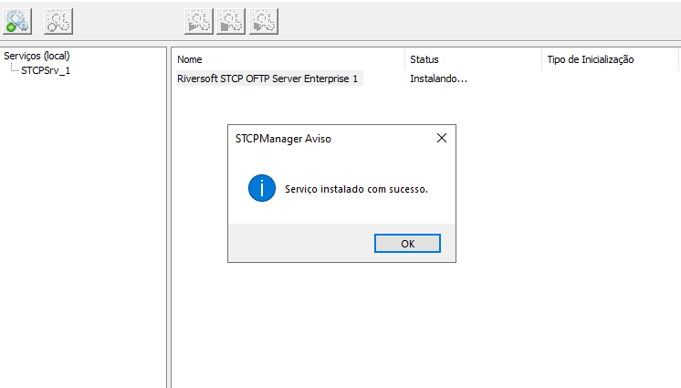
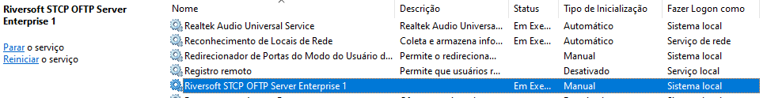

## Criar e iniciar

Para que sejá possível criar e iniciar o serviço do STCP OFTP Server, utilizaremos o **STCP OFTP Server Manager**.

O STCP OFTP Server Manager é um sistema gerenciador de serviços STCP, é similar ao gerenciador de serviços do Windows, embora seja usado somente para manipular serviços da família de **produtos do STCP**.

Esse sistema permite que seja instalado/desinstalado o serviço do Riversoft STCP OFTP Server Enterprise (STCPSrv_1) ou Lite (STCPSrvLite_1).

Também é permitido iniciar, parar e reiniciar um serviço, desde que se tenham as permissões apropriadas.

Acesse o STCP OFTP Server Configuration Manager (**Iniciar - Todos os programas - Riversoft STCP OFTP Server**), selecione o serviço _Riversoft STCP OFTP Server Enterprise 1/Lite 1_ e clique no botão _Instalar serviço_.

Uma mensagem confirmando que o serviço foi instalado com sucesso será exibida. Clique em _OK_ para finalizar.

Selecione o serviço recém-criado e clique no botão _Iniciar_.

O serviço será iniciado e seu status alterado para _Iniciado_. Esse servico também pode ser criado e removido pelo prompt de comando (cmd) do sistema operacional.

 

Para maiores detalhes, consulte o item, <a href="/stcpserver/03-util/" target="_blank">_Utilização_</a>  &nbsp; na documentação do STCP OFTP Server, para verificar como utilizar a aplicação por **linha de comando**.

 

