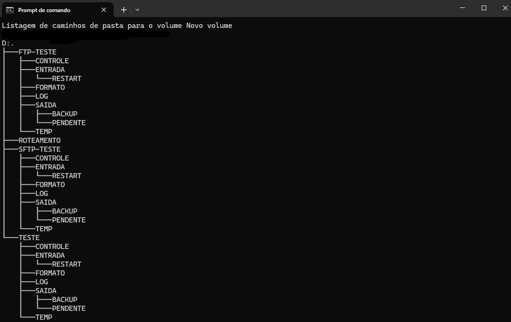
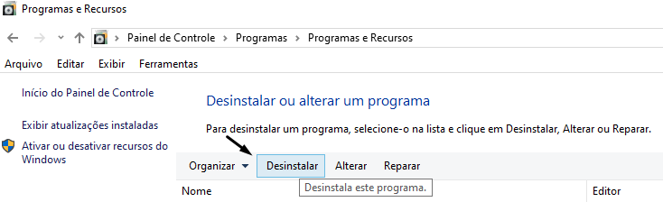
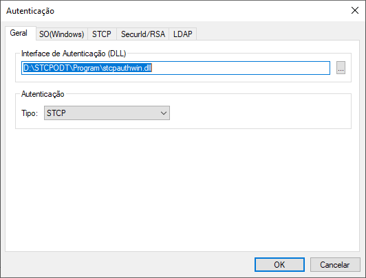
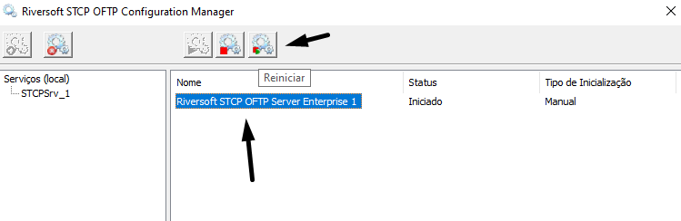

## Antes de Iniciar

Nos casos de migração de servidores, para preservar as configurações dos roteamentos (_STCPRen_) e agendamentos em operação no ambiente atual, recomendamos que o novo servidor possua as mesmas características (_hostname, endereço ip, recursos compartilhados_) ao antigo.

Antes de qualquer alteração no ambiente STCP, recomenda-se uma cópia de segurança dos diretórios de _Controle e Dados_ da aplicação.


## Migração dos Arquivos de Configuração (*.INI)

Para transferir as configurações do STCP, no servidor atual para um novo, após a instalação copie os arquivos de configuração *_.INI_, existentes no diretório de _Controle_ (Ex. **C:\STCPODT**), do servidor antigo para respectivo diretório do novo servidor.

Acesse o diretório de instalação do STCP no terminal e liste os arquivos com a extensão **.ini**

```bash {filename="D:\STCPODT"}
dir *.ini
```


* CTCP.INI
* CTCPSCHED.INI
* NOME-USUARIO1.INI ... NOME-USUARIO2.INI ...

## Migração Diretórios

A estrutura de pastas (Exemplo abaixo **D:\STCPODT\work\NOME-USUARIO**), configurada no diretório de **Dados** do STCP OFTP, também deverá ser copiada do **servidor atual** para o **novo**. Cada usuário criado (guia Usuários) possui a sua própria estrutura de pastas.




  Dependendo das configurações atuais do ambiente em questão, outros arquivos como: regras de roteamento, script VBS, arquivos de lote, dentre outros, deverão ser copiados dos seus respectivos diretórios para o novo servidor.


---
## STCP OFTP Server

Acesse o Riversoft STCP OFTP Server Manager como administrador (_Ex: D:\STCPODT\Program\Riversoft STCP OFTP Server Manager_) e pare o serviço da aplicação.


 Após parar o serviço, certifique de validar se o serviço está parado:


Após parar o serviço, certifique de deletá-lo, esse procedimento pode ser feito através do comando abaixo (Verifique as permissões e se necessário, execute o prompt como **administrador**)

```bash
sc delete [nome do serviço]
```


Em _Adicionar/Remover Programas_ no _Painel de Controle_ do Windows, remova a versão atual do STCP OFTP Server. A estrutura de diretórios da aplicação (_Controle e Dados_) será mantida, juntamente com os arquivos de configuração (.INI).


<br>


Faça o download, da versão nova versão, através do link que é dispnibilizado pela Equipe de Sustentação da Riversoft e realize a instalação do produto.


<Após o processo de instalação, acesse o STCP OFTP Server Config (**Iniciar - Todos os programas - Riversoft STCP OFTP Server**) e na guia _Avançadas_ clique no botão _Controle de Log_.


Na janela _Propriedades do Log_, no painel _Interface de Log (DLL)_, selecione a biblioteca de log desejada e clique no botão _OK_ para salvar esta alteração.

Para a gravação de log em **banco de dados** (ODBC), selecione o arquivo:
```
<disco>:\STCPODT\Program\stcplogodbc.dll
```


Para a gravação de log em **arquivo texto**, selecione o arquivo:
```
<disco>:\STCPODT\Program\stcplogtxt.dll
```


Ainda na guia _Avançadas_, clique no botão _Controle de Autenticação_.

Na guia _Geral da janela Autenticação_, no painel _Interface de Autenticação (DLL)_, selecione o arquivo: **[disco]:\STCPODT\Program\stcpauthwin.dll**

Certifique-se de que o campo _Tipo_, do painel _Autenticação_, esteja com o valor _STCP_ e clique no botão _OK_ para salvar as alterações realizadas.



Clique no botão _OK_ para fechar o STCP OFTP Server Config. O próximo passo é a criação do <a href="/utils/service/" target="_blank">serviço do STCP OFTP Server no Windows</a>  &nbsp;

## STCP Console

Conforme já mencionado, nas versões atualizadas do STCP OFTP Server, a console da aplicação (ícone na barra de tarefas do Windows), foi substituída pelo STCP Console.

O STCP Console é um sistema que tem como principal funcionalidade permitir que sejam realizadas atividades de supervisão e gerenciamento de um determinado servidor. Estas atividades envolvem a monitoração de usuários (monitora todos os usuários ativos) e a monitoração de eventos (monitora todos os eventos do servidor).


  Para utilização do STCP Console, uma rede (TCPIP_MON_1) utilizando o protocolo **Monitor - TCP/IP** deverá estar previamente criada e configurada, na guia Redes, do STCP OFTP Server.


Para configuração e uso do STCP Console, consulte a documentação do produto: [STCP Console](/utils/console/)

>NOTA: É importante lembrar que as atividades de supervisão e gerência, dos servidores STCP OFTP, podem ser realizadas, também, pela ferramenta **STCP OFTP Web Admin**.

## Rede de Monitoração - TCPIP_MON

Para utilização do STCP Console, uma rede (Ex. **TCPIP_MON_1**) utilizando o protocolo _Monitor – TCP/IP_ deverá estar previamente criada e configurada, na guia _Redes_, do STCP OFTP Server.

Por padrão da aplicação, para este tipo de rede é utilizada a porta 33050, que poderá ser alterada conforme especificações e/ou características da infraestrutura utilizada.

Acesse o STCP OFTP Server Config (Iniciar - Todos os programas - Riversoft STCP OFTP Server) e na guia _Redes_ clique no botão _Adicionar_ e selecione o protocolo _Monitor – TCP/IP_. Clique no botão _OK_ para confirmar.


Na janela _Propriedades da rede para Monitor_, preencha o campo descrição e selecione a guia _TCP/IP_.


Realize as configurações conforme imagem abaixo.


Selecione a guia _Monitor_ e preencha os campos abaixo:

```{filename="Usuário de monitoração"}

Usuário: stcpmon
Senha: stcpmon
Confirmar: stcpmon
```


Clique no botão _OK_ para salvar as alterações.

Clique no botão _OK_ novamente para finalizar o configurador.

Acesse o **STCP OFTP Server Manager** (_Iniciar - Todos os programas - Riversoft STCP OFTP Server_), selecione o serviço do _STCP OFTP Server_ e clique no botão _Reiniciar_.



Após o reinício do serviço a rede de monitoração _TCPIP_MON_1_ já estará ativa.

## STCP OFTP Client

### Antes de iniciar

Ao atualizar o STCP OFTP Client, para que não seja necessária a reconfiguração da aplicação e dos perfis já existentes, deverá ser feito um **backup** do arquivo de configuração da aplicação **CTCP.INI**, dos diretórios dos perfis (Ex.: **O0055RIVERSOFT**) e dos arquivos de configuração dos perfis (Ex.: **O0055RIVERSOFT.INI**) presentes no diretório de instalação da aplicação (Ex.: **C:\STCPCLT**).


### Instalar a nova versão

Clique no botão **Avançar**.


Esta é a tela de boas-vindas, clique no botão **Avançar** para continuar. Pressione **Voltar** para retornar à tela anterior ou **Cancelar** para interromper o processo de instalação.


Leia cuidadosamente o Contrato de Licença de Uso do Usuário Final e caso concorde com os termos propostos, marque a opção correspondente e pressione o botão **Avançar** para prosseguir com a instalação.


Pressione **Voltar** para retornar à tela anterior ou **Cancelar** para interromper o processo de instalação.


Na tela **Informações do Cliente**, informe o Nome do usuário e Organização (Empresa).

Pressione **Voltar** para retornar à tela anterior ou **Cancelar** para cancelar todo o processo de instalação.


Na tela **Pasta de Destino**, clique em **Avançar** para instalar no diretório padrão ou **Alterar** para selecionar outro diretório ou criar um novo. Pressione **Voltar** para retornar à tela anterior ou **Cancelar** para interromper o processo de instalação.


Na tela **Pronto para Instalar o Programa**, clique em **Qualquer pessoa que utilizar este computador (todos os usuários)** ou **Somente para mim (Riversoft)** para instalar. Pressione **Voltar** para retornar à tela anterior ou **Cancelar** para interromper o processo de instalação.


Na tela de conclusão do **Installshield**, clique no botão **Concluir** para finalizar a instalação.


Após a instalação do STCP OFTP Client, o arquivo de configuração **CTCP.INI**, os diretórios dos perfis (Ex.: **O0055RIVERSOFT**) e os arquivos de configuração dos perfis (Ex.: **O0055RIVERSOFT.INI**) deverão ser copiados e substituídos no diretório de instalação da aplicação (Ex.: **C:\STCPCLT**).
